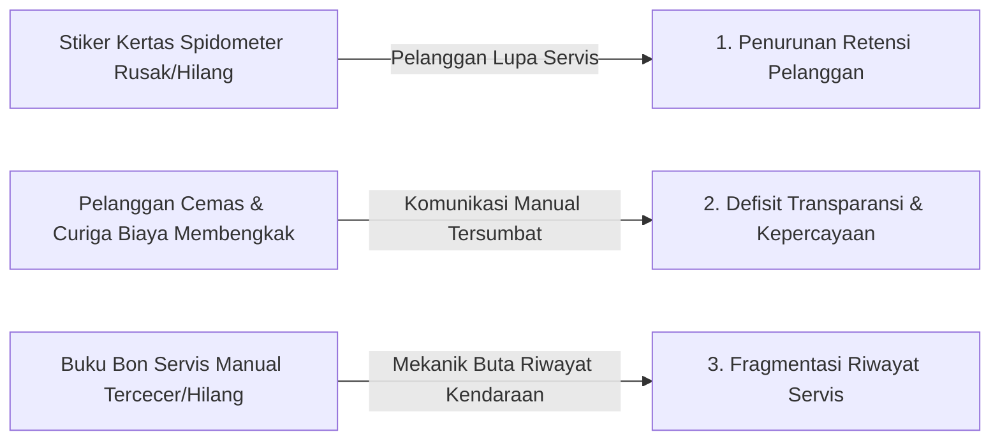
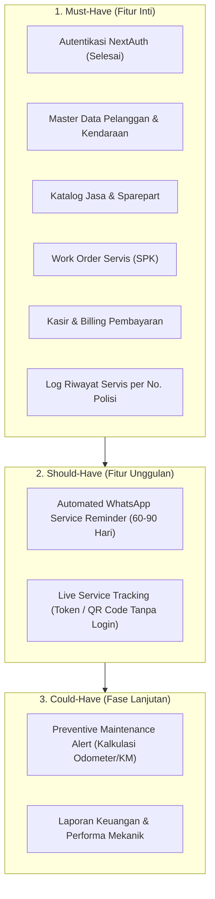
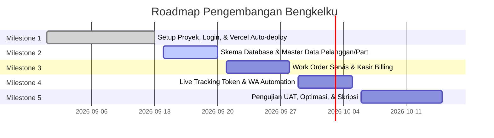

# PRODUCT REQUIREMENT DOCUMENT (PRD)
# BENGKELKU (bengkel-app)

> **Dokumen Spesifikasi Produk & Arsitektur Sistem**  
> **Versi:** 1.0.0  
> **Status:** Approved / Active Baseline  
> **Terakhir Diperbarui:** 13 September 2026  
> **Penulis:** Senior Product Manager & Software Architect  

---

## 1. Metadata Proyek

| Informasi | Keterangan |
| :--- | :--- |
| **Nama Aplikasi** | **Bengkelku** (`bengkel-app`) |
| **Deskripsi Singkat** | Sistem manajemen operasional bengkel terintegrasi yang mendigitalisasi pencatatan servis, kasir/billing, pelacakan pengerjaan secara transparan bagi pelanggan (*Live Service Tracking*), dan otomatisasi pengingat servis via WhatsApp (*Automated Service Reminder*). |
| **Tech Stack** | • **Framework:** Next.js 16.3.4 (App Router, Server Components & Actions)<br>• **UI & Core:** React 19.2.8, Tailwind CSS v4 (via `@tailwindcss/postcss`)<br>• **Bahasa:** TypeScript 5 (Strict Mode)<br>• **Autentikasi:** NextAuth.js v4.24.15 (Credentials & Google OAuth Provider)<br>• **Styling Khusus:** Custom Bengkelku Workspace Theme (`app/globals.css`) |
| **Repository GitHub** | [https://github.com/prabupmb1212-sketch/bengkel-app.git](https://github.com/prabupmb1212-sketch/bengkel-app.git) |
| **Production URL** | [https://bengkelkuapp.vercel.app](https://bengkelkuapp.vercel.app) |
| **Akun Demo / Testing**| • **Email:** `admin22@gmail.com`<br>• **Password:** `mamang22` |
| **Status Saat Ini** | **Milestone 1 Selesai (100%)**: Inisialisasi proyek, halaman kustom login (`app/login/page.tsx`), autentikasi NextAuth, routing redirects, dan deployment otomatis Vercel telah aktif dan berjalan stabil. |

---

## 2. Problem Statement

Operasional bengkel kendaraan konvensional (khususnya skala UMKM dan menengah) masih menghadapi 3 masalah fundamental:



### 1. Masalah Retensi Pelanggan (*Customer Retention Gap*)
Sebagian besar bengkel hanya mengandalkan stiker kertas bertuliskan tangan yang ditempel di spidometer atau kaca depan untuk mencatat kilometer/tanggal servis berikutnya. Stiker ini sering terkelupas, pudar terkena cuaca/pencucian, atau diabaikan oleh pelanggan. Dampaknya:
- Pelanggan terlambat melakukan servis berkala atau bahkan berpindah ke bengkel kompetitor terdekat saat timbul kendala mendadak.
- Bengkel kehilangan potensi *recurring revenue* dari basis pelanggan yang sebenarnya sudah puas.

### 2. Masalah Transparansi & Kepercayaan (*Trust & Transparency Deficit*)
Saat pelanggan menitipkan kendaraannya di bengkel, timbul kecemasan emosional:
- Ketidakpastian apakah kendaraan sedang dikerjakan, sedang menunggu suku cadang, atau sudah selesai.
- Kekhawatiran penggantian suku cadang sepihak atau biaya perbaikan yang membengkak tanpa persetujuan awal (*hidden cost*).
- Pelanggan terpaksa bolak-balik menelepon atau mengirim chat manual yang mengganggu konsentrasi mekanik dan kasir.

### 3. Masalah Arsip & Riwayat Servis (*Fragmented Service History & Diagnosis Inefficiency*)
Pencatatan nota manual pada lembaran kertas nota atau buku besar menyebabkan riwayat kerusakan kendaraan sebelumnya mudah hilang:
- Mekanik kesulitan mendiagnosis riwayat penggantian komponen terdahulu (misal: kapan terakhir ganti oli gardan, kampas rem, atau *timing belt*).
- Riwayat keluhan pelanggan yang berulang tidak terekam, sehingga solusi mekanik sering kali bersifat coba-coba (*trial & error*) yang memakan waktu dan menurunkan reputasi bengkel.

---

## 3. Value Proposition

> **"Aplikasi bengkel-app tidak hanya membantu mencatat transaksi servis dan suku cadang secara efisien, tetapi juga mempertahankan loyalitas pelanggan melalui pengingat servis otomatis via WhatsApp dan pelacakan progres perbaikan yang transparan."**

Dengan memadukan fungsi pencatatan internal (back-office) dan jembatan komunikasi digital langsung ke pelanggan (customer-facing tanpa beban instalasi aplikasi), `bengkel-app` mentransformasi bengkel konvensional menjadi entitas modern yang profesional, tepercaya, dan memiliki retensi pelanggan tinggi.

---

## 4. User Personas & Role-Based Access Control (RBAC)

Aplikasi dirancang untuk melayani 4 profil pengguna dengan hak akses spesifik:

### Persona Profil
1. **Owner / Admin Bengkel (Pak Joko):** Pemilik bengkel yang membutuhkan visibilitas penuh terhadap operasional, kas masuk, data pelanggan, stok suku cadang, dan analitik retensi.
2. **Kasir / Front Desk (Siti):** Petugas meja depan yang menerima pelanggan, mencetak estimasi/faktur pembayaran, mengelola pembayaran tunai/transfer, dan mengirimkan notifikasi via WhatsApp.
3. **Mekanik / Teknisi (Budi):** Teknisi pengerjaan fisik kendaraan yang memeriksa keluhan, mencatat kebutuhan suku cadang riil, dan memperbarui status pengerjaan pengerjaan unit secara aktual.
4. **Pelanggan Publik (Rian):** Pemilik kendaraan yang ingin memantau status kendaraannya secara santai dan transparan melalui smartphone tanpa perlu repot membuat akun atau login.

### Matriks Hak Akses (RBAC Matrix)

| Fitur / Modul | Owner / Admin | Kasir | Mekanik | Pelanggan Publik |
| :--- | :---: | :---: | :---: | :---: |
| **Login Dashboard Internal** | Ya (Full) | Ya (Terbatas) | Ya (Terbatas) | Tidak |
| **Kelola Master Data (Suku Cadang/Jasa/Harga)** | Penuh (CRUD) | Baca Saja | Baca Saja | Tidak Ada Akses |
| **Kelola Data Pelanggan & Kendaraan** | Penuh (CRUD) | Penuh (CRUD) | Baca Saja | Tidak Ada Akses |
| **Buat & Edit Work Order (SPK)** | Penuh (CRUD) | Penuh (CRUD) | Update Pengerjaan | Tidak Ada Akses |
| **Update Status Pengerjaan (*Progress*)** | Ya | Ya | Ya | Baca Saja (via Token) |
| **Billing, Invoice, & Terima Pembayaran** | Ya | Ya | Tidak | Akses Faktur Digital |
| **Akses Live Service Tracking via Token/QR** | Ya | Ya | Ya | **Ya (Tanpa Login)** |
| **Trigger Kirim Reminder WhatsApp** | Ya | Ya | Tidak | Tidak |
| **Konfigurasi Akun & Pengaturan Sistem** | Ya | Tidak | Tidak | Tidak |

---

## 5. Spesifikasi Fitur (MoSCoW Framework)



### 5.1. Fitur Inti (Must-Have)
1. **Autentikasi Pengguna & Keamanan Sesi (*Status: Selesai*)**
   - Halaman login kustom Bengkelku (`app/login/page.tsx`).
   - Autentikasi ganda via Credentials (Email/Password) dan Google OAuth.
   - Proteksi rute berbasis sesi NextAuth.
2. **Master Data Pelanggan & Kendaraan**
   - Data Pelanggan: Nama, No. WhatsApp aktif, Alamat, Catatan Khusus.
   - Data Kendaraan: Nomor Polisi (Plat No unik), Merk, Model/Tipe, Tahun Pembuatan, Nomor Rangka/Mesin (opsional).
   - Relasi 1 Pelanggan dapat memiliki lebih dari 1 kendaraan (*1-to-Many*).
3. **Katalog Jasa Servis & Sparepart (Inventaris)**
   - Jasa Servis: Kode jasa, nama tindakan (misal: "Ganti Oli Mesin", "Tune Up Injeksi", "Bongkar CVT"), tarif jasa.
   - Suku Cadang (*Sparepart*): Kode part/SKU, nama part, stok saat ini, stok minimum peringatan (*low stock warning*), harga beli (HPP), dan harga jual.
4. **Pencatatan Servis (Work Order / Surat Perintah Kerja)**
   - Registrasi pendaftaran masuk: Tanggal/jam, odometer saat masuk, keluhan awal pelanggan, nama mekanik yang ditugaskan.
   - Rincian estimasi pengerjaan: Daftar jasa yang dipilih dan suku cadang yang digunakan.
   - Status pengerjaan bertahap:
     - `ANTRIAN` (Menunggu giliran pengerjaan)
     - `PENGERJAAN` (Sedang ditangani oleh mekanik)
     - `MENUNGGU_PART` (Tertunda karena menunggu suku cadang/konfirmasi)
     - `SELESAI_PENGERJAAN` (Selesai dites, siap pembayaran)
     - `SELESAI_PEMBAYARAN` (Faktur lunas, unit diserahkan ke pelanggan)
5. **Kasir & Billing Pembayaran (Invoice/Nota)**
   - Kalkulasi otomatis: Total Biaya Jasa + Total Biaya Sparepart - Diskon = Total Tagihan.
   - Metode pembayaran: Tunai (*Cash*) dan Transfer Manual (BCA/Mandiri/QRIS statis).
   - Input jumlah bayar & hitung kembalian secara presisi.
   - Cetak nota kasir (format struk thermal 58mm/80mm atau format cetak PDF invoice).
6. **Log Riwayat Servis per Nomor Polisi (*Service History Log*)**
   - Fitur pencarian cepat berdasarkan Plat Nomor (contoh: `B 1234 XYZ`).
   - Rekam jejak seluruh tanggal kunjungan sebelumnya, kilometer masa lampau, daftar part yang pernah diganti, dan catatan mekanik terdahulu.

---

## 5.2. Fitur Bernilai Tambah (Should-Have)
1. **Automated WhatsApp Service Reminder**
   - Logika Interval Cerdas: Sistem menandai kendaraan yang telah melewati interval waktu **60 hingga 90 hari** sejak tanggal servis terakhir atau tanggal ganti oli.
   - Tombol Aksi Sekali Klik: Kasir/Admin dapat menekan tombol "Kirim Pengingat WA" dari daftar kendaraan jatuh tempo.
   - Template Pesan Otomatis (Deep Link `https://wa.me/{nomor}`):
     > *"Halo Bpk/Ibu [Nama Pelanggan], kami dari Bengkelku menginformasikan bahwa kendaraan [Merk/Model] dengan plat nomor [Plat Nomor] sudah memasuki waktu servis berkala/ganti oli (terakhir servis tanggal [Tanggal Servis]). Yuk rawat performa kendaraan Anda kembali di bengkel kami. Balas pesan ini untuk reservasi waktu. Terima kasih!"*
2. **Live Service Tracking (Pelacakan Transparan Tanpa Login)**
   - Halaman publik ringan (`/track/[token]`) yang aman dengan token URL acak (UUID/NanoID).
   - Akses Mudah: Dicantumkan berupa link pendek atau QR Code pada lembar tanda terima/struk masuk.
   - Pelanggan dapat memantau:
     - Status kendaraan secara *real-time* (Antrian → Dikerjakan → Selesai).
     - Rincian suku cadang & jasa yang dikerjakan beserta nominal biaya transparan.
     - Estimasi waktu selesai dan informasi kontak langsung ke bengkel.

---

## 5.3. Fitur Masa Depan (Could-Have)
1. **Preventive Maintenance Alert Berbasis Kilometer**
   - Estimasi laju kilometer harian kendaraan berdasarkan delta kilometer antar-servis sebelumnya.
   - Rekomendasi servis preventif (contoh: Peringatan otomatis penggantian vanbelt/timing belt setiap kelipatan 24.000 KM).
2. **Laporan Pendapatan & Kinerja Mekanik**
   - Laporan omset harian/bulanan (pendapatan jasa vs penjualan sparepart).
   - Rekap komisi pengerjaan per mekanik.

---

## 6. Batasan Ruang Lingkup (Scope Boundaries)

Untuk menjaga ketepatan waktu pengiriman dan stabilitas sistem, batas ruang lingkup ditetapkan secara tegas:

```
┌───────────────────────────────────────────────┬───────────────────────────────────────────────┐
│                   IN-SCOPE                    │                 OUT-OF-SCOPE                  │
├───────────────────────────────────────────────┼───────────────────────────────────────────────┤
│ • Arsitektur Monolitik Next.js App Router     │ • Integrasi Hardware OBD-II Scanner           │
│ • Database Relasional (Pelanggan/Servis/Part) │ • Inventori Multi-Cabang & Multi-Gudang       │
│ • Pelacakan Publik via Unique Token (/track)  │ • Payment Gateway Otomatis (Midtrans/Xendit)  │
│ • Kasir Manual (Tunai / Transfer Manual)      │ • Modul Akuntansi Pajak Kompleks (e-Faktur)   │
│ • Trigger Reminder via WhatsApp Deep Link     │ • Aplikasi Mobile Native (iOS / Android APK)  │
│ • Cetak Nota Struk Web/PDF                    │ • Integrasi GPS Tracking Posisi Kendaraan     │
└───────────────────────────────────────────────┴───────────────────────────────────────────────┘
```

---

## 7. Arsitektur Folder yang Direncanakan

Struktur folder direncanakan secara modular berbasis Next.js App Router, **dengan mempertahankan integritas modul login dan CSS yang sudah aktif di production**:

```text
bengkel-app/
├── app/
│   ├── (auth)/
│   │   └── login/
│   │       └── page.tsx              # [STABIL] Halaman login kustom Bengkelku (TETAP DIPERTAHANKAN)
│   ├── (dashboard)/
│   │   ├── layout.tsx                # Shell Dashboard (Sidebar, Header Nav, Session Provider)
│   │   ├── dashboard/
│   │   │   └── page.tsx              # Overview metrik servis, antrian hari ini, quick stats
│   │   ├── services/
│   │   │   ├── page.tsx              # Daftar Work Order (Antrian, Dikerjakan, Selesai)
│   │   │   ├── new/page.tsx          # Form penerimaan servis baru (Input SPK)
│   │   │   └── [id]/page.tsx         # Detail pengerjaan servis & update status mekanik
│   │   ├── customers/
│   │   │   ├── page.tsx              # Manajemen master data pelanggan & kendaraan
│   │   │   └── [id]/page.tsx         # Detail riwayat servis per pelanggan & nomor polisi
│   │   ├── inventory/
│   │   │   ├── parts/page.tsx        # Katalog & stok sparepart (Peringatan stok menipis)
│   │   │   └── services/page.tsx     # Master data jasa servis & tarif
│   │   ├── cashier/
│   │   │   ├── page.tsx              # Antrian kasir & pembayaran faktur
│   │   │   └── [id]/invoice.tsx      # Tampilan cetak nota / faktur kasir
│   │   └── reminders/
│   │       └── page.tsx              # Daftar kendaraan jatuh tempo (60-90 hari) & tombol kirim WA
│   ├── track/
│   │   └── [token]/
│   │       └── page.tsx              # [PUBLIK] Live Service Tracking tanpa login bagi pelanggan
│   ├── api/
│   │   ├── auth/
│   │   │   └── [...nextauth]/
│   │   │       └── route.ts          # [STABIL] API Handler NextAuth
│   │   └── reminders/
│   │       └── whatsapp/route.ts     # Endpoint pembantu pembentukan payload/URL WhatsApp
│   ├── favicon.ico
│   ├── globals.css                   # [STABIL] Styling tema Bengkelku & utilitas Tailwind v4
│   ├── layout.tsx                    # [STABIL] Root Layout utama
│   └── page.tsx                      # Root Page (mengarah ke dashboard/login)
├── components/
│   ├── ui/                           # Komponen UI atomik (Button, Input, Modal, Badge, Table)
│   ├── dashboard/                    # Komponen navigasi (Sidebar, Topbar, StatusBadge)
│   ├── services/                     # Komponen antrian servis, dialog tambah part/jasa
│   └── tracking/                     # Komponen visual timeline pengerjaan live tracking
├── lib/
│   ├── auth.ts                       # Konfigurasi NextAuth terpusat (authOptions)
│   ├── db.ts                         # Client koneksi database
│   ├── whatsapp.ts                   # Utilitas format nomor telepon & template pesan WA
│   └── utils.ts                      # Helper format mata uang (Rupiah), format tanggal lokal ID
├── middleware.ts                     # Proteksi rute internal (/dashboard/*) tanpa mengunci /track/*
├── PRD.md                            # [DOKUMEN INI] Single Source of Truth Spesifikasi Produk
├── next.config.ts                    # Konfigurasi Next.js
├── package.json                      # Dependensi proyek
└── tsconfig.json                     # Konfigurasi TypeScript
```

---

## 8. Roadmap & Milestone Pengembangan



### Milestone 1: Fondasi Proyek, Autentikasi, & Baseline Deployment (*STATUS: COMPLETED - 100%*)
- Inisialisasi Next.js 16 App Router dengan TypeScript & Tailwind CSS v4.
- Implementasi halaman kustom login (`app/login/page.tsx`) dengan desain premium workspace Bengkelku.
- Integrasi NextAuth.js (Credentials & Google OAuth Provider).
- Setup CI/CD dan deployment stabil di Vercel (`https://bengkelkuapp.vercel.app`).

### Milestone 2: Skema Database & Manajemen Master Data (*ESTIMASI: MINGGU 1*)
- Penetapan skema database relasional (Tabel `Users`, `Customers`, `Vehicles`, `ServicesCatalog`, `PartsInventory`).
- Setup data access layer & ORM yang sesuai.
- Implementasi CRUD Master Pelanggan & Kendaraan (1 Pelanggan dapat memiliki banyak kendaraan).
- Implementasi CRUD Katalog Jasa Servis & Inventaris Suku Cadang (dengan indikator stok minimum).

### Milestone 3: Alur Pengerjaan Servis (Work Order) & Kasir/Billing (*ESTIMASI: MINGGU 2*)
- Form pendaftaran kendaraan masuk: catat keluhan, kilometer, mekanik penanggung jawab.
- Modul pengerjaan servis: penambahan pemakaian suku cadang dan jasa teknisi secara dinamis.
- Manajemen status pengerjaan: `ANTRIAN` → `PENGERJAAN` → `MENUNGGU_PART` → `SELESAI_PENGERJAAN`.
- Modul Kasir & Pembayaran: hitung total jasa & part, kalkulasi kembalian, update status menjadi `SELESAI_PEMBAYARAN`.
- Template faktur & struk pembayaran (siap cetak).

### Milestone 4: Fitur Unggulan — Live Service Tracking & WA Automation (*ESTIMASI: MINGGU 3*)
- **Live Service Tracking**:
  - Generator token acak unik (NanoID/UUID) pada setiap Work Order.
  - Halaman publik `/track/[token]` yang responsif untuk smartphone pelanggan tanpa perlu login.
  - Visual timeline progres pengerjaan & rincian biaya aktual.
- **Automated WhatsApp Service Reminder**:
  - Filter analitik kendaraan yang telah melewati masa servis 60–90 hari.
  - Tombol aksi trigger link `wa.me` dengan format pesan personal otomatis untuk reservasi kembali.

### Milestone 5: Pengujian (UAT), Hardening, & Finalisasi Skripsi (*ESTIMASI: MINGGU 4*)
- Pemasangan `middleware.ts` untuk proteksi rute dashboard internal tanpa mengganggu halaman login dan tracking publik.
- User Acceptance Testing (UAT) simulasi alur end-to-end (Pendaftaran → Pengerjaan → Live Tracking → Kasir → Reminder).
- Optimasi performa LCP/INP & audit aksesibilitas.
- Penyusunan dokumentasi teknis & lampiran hasil pengujian untuk skripsi/laporan akhir.

---

> **Persetujuan & Kebijakan Perubahan:**  
> Segala modifikasi terhadap spesifikasi di atas harus melalui peninjauan ulang Product Manager dan tidak boleh merusak modul yang telah dideklarasikan stabil pada Milestone 1.
