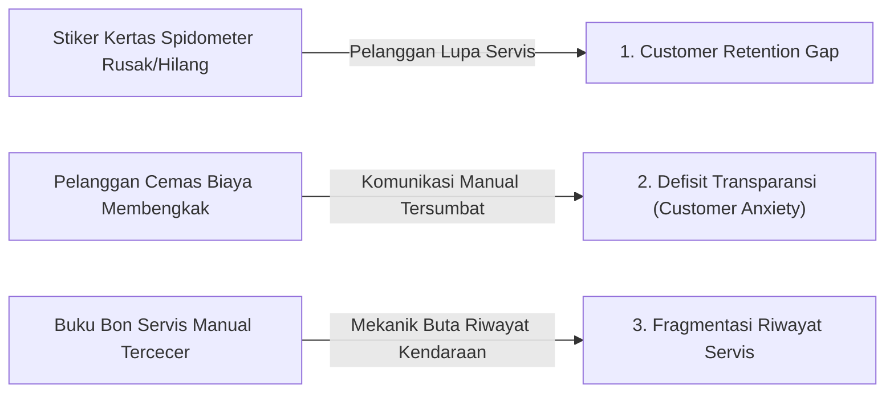

# LAPORAN TUGAS EKSPLORASI PRODUK DAN PERANCANGAN FITUR BERNILAI TAMBAH
**Topik:** Belajar dari Mibebi Kasir sebelum Menyusun PRD dan Melakukan Vibe Coding  
**Studi Kasus Transfer Domain:** Sistem Informasi Manajemen Bengkel (`bengkel-app`)  
**Mata Kuliah / Konteks:** Rekayasa Perangkat Lunak & Proyek Tugas Akhir / Skripsi  
**Penyusun:** Mahasiswa Tugas Akhir  
**Status Dokumen:** Laporan Akademik Lengkap (Bagian I, II, dan III Sesuai PRD Proyek)  
**Tanggal:** 14 September 2026  

---

## DAFTAR ISI

- [BAGIAN I — EKSPLORASI MIBEBI KASIR (DOMAIN F&B)](#bagian-i--eksplorasi-mibebi-kasir-domain-fb)
  - [A. Mencoba Aplikasi (Simulasi 6 Skenario F&B)](#a-mencoba-aplikasi-simulasi-6-skenario-fb)
  - [B. Identifikasi Fitur Inti Mibebi Kasir & Uji Eliminasi](#b-identifikasi-fitur-inti-mibebi-kasir--uji-eliminasi)
  - [C. Identifikasi Fitur Bernilai Tambah Mibebi Kasir](#c-identifikasi-fitur-bernilai-tambah-mibebi-kasir)
  - [D. Memahami Value Proposition (Analisis Kritis 5 Pertanyaan)](#d-memahami-value-proposition-analisis-kritis-5-pertanyaan)
  - [E. Product Teardown Mibebi Kasir (6 Pilar Bisnis)](#e-product-teardown-mibebi-kasir-6-pilar-bisnis)
- [BAGIAN II — CONTOH ANALISIS PRODUK (MIBEBI KASIR SEBAGAI WORKED EXAMPLE)](#bagian-ii--contoh-analisis-produk-mibebi-kasir-sebagai-worked-example)
  - [1. Judul Produk & Deskripsi](#1-judul-produk--deskripsi)
  - [2. Identifikasi Masalah Utama F&B](#2-identifikasi-masalah-utama-fb)
  - [3. Fitur Inti vs Fitur Bernilai Tambah](#3-fitur-inti-vs-fitur-bernilai-tambah)
  - [4. Value Proposition Mibebi (Lapisan 1 Core System vs Lapisan 2 Value-Added)](#4-value-proposition-mibebi-lapisan-1-core-system-vs-lapisan-2-value-added)
- [BAGIAN III — TRANSFER KE PROYEK SKRIPSI (DISESUAIKAN DENGAN PRD bengkel-app)](#bagian-iii--transfer-ke-proyek-skripsi-disesuaikan-dengan-prd-bengkel-app)
  - [F. Judul dan Masalah Proyek](#f-judul-dan-masalah-proyek)
  - [G. Tentukan Fitur Inti (Minimal 5 Fitur Inti bengkel-app)](#g-tentukan-fitur-inti-minimal-5-fitur-inti-bengkel-app)
  - [H. Usulkan 3 Fitur Bernilai Tambah (Sesuai PRD)](#h-usulkan-3-fitur-bernilai-tambah-sesuai-prd)
  - [I. Jangan Menyalin Mibebi (Prinsip Transfer Domain F&B ke Otomotif)](#i-jangan-menyalin-mibebi-prinsip-transfer-domain-fb-ke-otomotif)
  - [J. Prioritas Fitur (MoSCoW Framework)](#j-prioritas-fitur-moscow-framework)
  - [K. Tentukan Scope (In-Scope vs Out-of-Scope)](#k-tentukan-scope-in-scope-vs-out-of-scope)
  - [L. Rumuskan Value Proposition](#l-rumuskan-value-proposition)
  - [M. Refleksi Akademik (5 Pertanyaan Evaluatif)](#m-refleksi-akademik-5-pertanyaan-evaluatif)

---

# BAGIAN I — EKSPLORASI MIBEBI KASIR (DOMAIN F&B)

## A. Mencoba Aplikasi (Simulasi 6 Skenario F&B)

Eksplorasi terhadap produk **Mibebi Kasir**—sebuah platform *Point of Sale* (POS) modern berbasis cloud untuk industri makanan dan minuman (*Food & Beverage*)—dilakukan melalui simulasi 6 skenario alur operasional:

```
┌────────────────────────────────────────────────────────────────────────────────────────┐
│                        SIMULASI 6 SKENARIO MIBEBI KASIR                                │
└────────────────────────────────────────────────────────────────────────────────────────┘
  [1. Data Menu]          [2. Input Pesanan]      [3. Transaksi Kasir]
   Kategori & Modifier  ──> Meja & Cart System ──> Multi-Bayar & Kembalian
          │                       │                       │
          ▼                       ▼                       ▼
  [4. Riwayat Transaksi]  [5. Laporan Penjualan]  [6. Fitur Loyalitas]
   Audit Log & Reprint  ──> Rekap Omset Shift  ──> Poin, Member & Win-Back
```

1. **Membuat atau Melihat Data Menu:**
   - Menyiapkan struktur menu bertingkat: Kategori (Makanan Utama, Minuman, Makanan Ringan, Pencuci Mulut), Harga Pokok Penjualan (HPP), Harga Jual resmi, dan varian/opsi ekstra (*modifiers* seperti tingkat kepedasan, *less sugar*, atau *extra topping*).
   - *Temuan:* Katalog menu terstruktur mempercepat navigasi kasir saat jam sibuk dan mencegah pesanan item yang stok bahannya habis (*out-of-stock alert*).
2. **Membuat Sebuah Pesanan:**
   - Menerima pesanan pelanggan berdasarkan nomor meja (*dine-in*) atau bungkus bawa pulang (*takeaway*). Memilih item dari antarmuka visual, menyematkan catatan khusus dapur (*kitchen notes*), dan memasukkan pesanan ke keranjang belanja.
   - *Temuan:* Modul pemesanan visual meminimalkan salah dengar pesanan dan mengeliminasi kertas tiket dapur bertulisan tangan yang rawan hilang.
3. **Melakukan Simulasi Transaksi Kasir:**
   - Melakukan penutupan pesanan dengan kalkulasi subtotal otomatis, penambahan pajak restoran (PB1) dan *service charge*, pemotongan voucher diskon, hingga pemilihan kanal bayar (Tunai, Debit/Kredit, QRIS Dinamis).
   - *Temuan:* Perhitungan uang kembalian secara otomatis mengeliminasi selisih kas fisik (*cash discrepancy*) dan mencetak struk thermal 58/80mm seketika.
4. **Melihat Riwayat Transaksi:**
   - Menelusuri arsip transaksi lampau berdasarkan nomor faktur, jam transaksi, atau ID kasir bertugas, serta melakukan cetak ulang struk (*reprint receipt*) atau pembatalan transaksi (*void*) berizin otorisasi supervisor.
   - *Temuan:* Log transaksi yang bersifat *append-only* (tidak dapat diubah sembarangan) menjamin akuntabilitas finansial dan memudahkan investigasi saat rekonsiliasi.
5. **Melihat Laporan Penjualan Harian:**
   - Memantau dasbor rekapitulasi harian: total omset kotor dan bersih, perincian metode bayar, jumlah transaksi (*guest count*), dan peringkat menu terlaris (*best-seller items*).
   - *Temuan:* Memangkas waktu tutup buku (*shift closing*) dari 1–2 jam hitung manual menjadi 3 menit instan.
6. **Mencoba Fitur Loyalitas Member & Retensi:**
   - Mendaftarkan nomor WhatsApp pelanggan saat pembayaran tanpa formulir kertas. Setiap kelipatan transaksi otomatis menambah poin member, dan sistem menandai pelanggan yang sudah lama tidak berkunjung.
   - *Temuan:* Mengubah transaksi kasir anonim menjadi basis data pelanggan terstruktur untuk mendorong kunjungan ulang (*repeat purchase*).

---

## B. Identifikasi Fitur Inti Mibebi Kasir & Uji Eliminasi

### 1. Daftar 5 Fitur Inti Mibebi Kasir

1. **Fitur: Manajemen Menu & Harga**
   - **Fungsi:** Mengelola daftar nama hidangan, kategori, varian opsi, serta penetapan harga jual resmi.
   - **Mengapa Dibutuhkan:** Kasir memerlukan referensi harga yang terstandardisasi dan konsisten agar tidak mengandalkan ingatan staf yang rawan keliru.
2. **Fitur: Manajemen Pesanan (Order Entry / Cart System)**
   - **Fungsi:** Menghimpun item yang dipesan pelanggan ke dalam satu tiket/keranjang aktif, mencatat nomor meja/layanan, dan meneruskan pesanan ke dapur.
   - **Mengapa Dibutuhkan:** Memungkinkan pelanggan memesan lebih dari satu item sekaligus dalam satu sesi transaksi yang terstruktur.
3. **Fitur: Transaksi Pembayaran & Kasir (Payment Processing & Billing)**
   - **Fungsi:** Menghitung total tagihan (termasuk pajak/diskon), memproses uang pembayaran dari berbagai metode, menghitung kembalian, dan mencetak bukti pembayaran (struk).
   - **Mengapa Dibutuhkan:** Merupakan titik temu pertukaran nilai ekonomi sah antara penjual dan pembeli.
4. **Fitur: Riwayat Transaksi (Transaction Logging & Audit Trail)**
   - **Fungsi:** Menyimpan seluruh data transaksi yang telah selesai, dibatalkan (*void*), atau dikembalikan (*refund*) lengkap dengan stempel waktu dan identitas kasir.
   - **Mengapa Dibutuhkan:** Menjadi rujukan utama ketika terjadi komplain pesanan dan memfasilitasi audit keuangan harian.
5. **Fitur: Laporan Penjualan Dasar (Daily Sales Reporting & Shift Closing)**
   - **Fungsi:** Menyajikan ringkasan omset harian, rincian uang kas masuk vs non-tunai, dan daftar menu terjual pada akhir giliran kerja.
   - **Mengapa Dibutuhkan:** Diperlukan kasir untuk mencocokkan fisik uang laci dengan sistem (*closing register*) serta pemilik usaha untuk memantau perputaran arus kas.

### 2. Uji Eliminasi Fitur Inti
> **Pertanyaan:** *Jika fitur-fitur tersebut tidak tersedia, apakah Mibebi masih dapat disebut sebagai aplikasi kasir? Jelaskan.*

**Jawaban:**  
**TIDAK DAPAT.** Jika salah satu dari kelima fitur tersebut dihilangkan, sistem kehilangan hakikat fungsinya sebagai sistem kasir (Point of Sale):
- Tanpa **Manajemen Menu**, kasir tidak memiliki daftar komoditas yang dijual, mereduksi sistem menjadi sekadar kalkulator saku biasa tanpa nama item.
- Tanpa **Manajemen Pesanan**, kasir tidak dapat menampung multi-item belanjaan dalam satu tagihan meja.
- Tanpa **Transaksi Pembayaran**, sistem hanya berfungsi sebagai *e-menu* atau katalog pajangan digital tanpa kemampuan komersialisasi.
- Tanpa **Riwayat Transaksi**, bisnis kehilangan akuntabilitas audit dan membuka celah kecurangan kasir tanpa jejak digital.
- Tanpa **Laporan Penjualan**, pemilik usaha menjadi buta finansial dan kasir tidak dapat melakukan serah-terima giliran kerja secara bertanggung jawab.

---

## C. Identifikasi Fitur Bernilai Tambah Mibebi Kasir

### 1. Fitur yang Bukan Sekadar Fitur Kasir (Di Luar Transaksi Dasar)
Dari eksplorasi Mibebi Kasir, ditemukan berbagai fitur inovatif di luar fungsi kasir dasar:
1. *Rekomendasi Menu Pendamping (Cross-selling Engine)*
2. *Member dan Loyalty Point (Retention Engine)*
3. *Reminder dan Voucher Pelanggan Pasif (Win-back Churn)*
4. *Pesan Hati (Pesan personalisasi pada e-receipt)*
5. *Last Bite (Flash sale diskon menu menjelang tutup toko untuk menekan food waste)*
6. *QR Meja / Self Order (Pemesanan mandiri pelanggan via browser smartphone)*
7. *Mode Dapur / Kitchen Display System (Layar antrean koki real-time)*
8. *Laporan Bisnis Harian Otomatis via Email/WhatsApp ke Owner*

---

### 2. Analisis Mendalam 3 Fitur Bernilai Tambah Terpilih

```
┌────────────────────────────────────────────────────────────────────────────────────────┐
│                      3 FITUR BERNILAI TAMBAH TERPILIH MIBEBI                           │
├───────────────────────────────┬───────────────────────┬────────────────────────────────┤
│ Fitur Inovatif                │ Dampak Bisnis         │ Tujuan Strategis               │
├───────────────────────────────┼───────────────────────┼────────────────────────────────┤
│ 1. Rekomendasi Menu Pendamping│ Peningkatan ATV       │ Cross-selling & Upselling      │
│ 2. Member & Loyalty Point     │ Peningkatan CLV       │ Customer Retention & Loyalty   │
│ 3. Reminder & Voucher Churn   │ Penurunan Churn Rate  │ Win-Back Pelanggan Pasif       │
└───────────────────────────────┴───────────────────────┴────────────────────────────────┘
```

#### Fitur 1: Rekomendasi Menu Pendamping (Automated Cross-Selling Engine)
- **Masalah:** Nilai transaksi rata-rata (*Average Transaction Value* / ATV) gerai F&B rendah karena pelanggan hanya memesan menu utama. Kasir sering lupa atau canggung menawarkan makanan pelengkap/minuman saat antrean padat.
- **Cara Kerja:** Ketika kasir memilih menu utama tertentu (misal: "Burger Sapi Spesial"), sistem secara otomatis memunculkan kartu rekomendasi di layar kasir bertuliskan: *"Tawarkan French Fries (+Rp 12.000) atau Lemon Tea (+Rp 8.000)?"*. Kasir cukup menekan satu tombol untuk memasukkannya ke pesanan.
- **Pengguna yang Mendapatkan Manfaat:**
  - *Kasir:* Memiliki panduan upselling instan tanpa perlu menghafal katalog promo.
  - *Owner:* Nilai penjualan per tiket transaksi naik secara konsisten.
  - *Pelanggan:* Memperoleh kepraktisan paket santapan lengkap dengan harga hemat.
- **Dampak Bisnis:** **Meningkatkan Average Transaction Value (ATV)** sebesar 15%–25% dari total tiket harian.
- **Nilai Tambah:** Mengubah aplikasi kasir dari pencatat pesanan pasif (*passive order taker*) menjadi tenaga penjual otomatis (*active salesperson*).

#### Fitur 2: Member dan Loyalty Point (Retention Engine)
- **Masalah:** Retensi pelanggan F&B sangat rapuh; pelanggan sangat mudah berpindah ke kafe pesaing terdekat akibat promo sesaat, menyebabkan biaya akuisisi pelanggan baru (*Customer Acquisition Cost* / CAC) tinggi.
- **Cara Kerja:** Kasir cukup meminta nomor WhatsApp pelanggan saat pembayaran. Sistem secara otomatis membuat akun anggota tanpa formulir manual atau download aplikasi. Setiap transaksi Rp 10.000 menghasilkan 1 poin. Akumulasi poin dapat ditukarkan menjadi potongan diskon atau menu gratis pada kunjungan berikutnya.
- **Pengguna yang Mendapatkan Manfaat:**
  - *Pelanggan:* Merasa dihargai dan memperoleh keuntungan finansial nyata saat kembali.
  - *Owner:* Membangun basis data pelanggan terverifikasi untuk pemasaran berulang.
- **Dampak Bisnis:** **Meningkatkan Customer Lifetime Value (CLV)** dan menaikkan tingkat kunjungan ulang (*repeat purchase rate*) sebesar 20%–30%.
- **Nilai Tambah:** Membangun *switching barrier* emosional dan finansial; pelanggan enggan makan di resto lain karena poinnya tersimpan di Mibebi.

#### Fitur 3: Reminder dan Voucher Pelanggan Pasif (Automated Win-Back Engine)
- **Masalah:** Pelanggan yang awalnya puas sering kali berhenti datang tanpa disadari oleh manajemen resto (*customer churn*). Tanpa sistem digital, bisnis tidak tahu siapa yang berhenti datang.
- **Cara Kerja:** Sistem secara otomatis memindai basis data transaksi secara berkala. Jika pelanggan terdaftar tidak bertransaksi selama $>30\text{ hari}$ sejak kunjungan terakhir, sistem otomatis menerbitkan voucher personal (misal: "Diskon 20% Kami Rindu Kamu") dan mengirimkannya langsung via WhatsApp API.
- **Pengguna yang Mendapatkan Manfaat:**
  - *Pelanggan:* Merasa diingat secara personal dan mendapatkan insentif diskon.
  - *Owner:* Menyelamatkan potensi omset yang hilang (*lost revenue*) secara otomatis.
- **Dampak Bisnis:** **Menurunkan Churn Rate** dan meningkatkan *win-back rate* pelanggan pasif tanpa biaya iklan berbayar baru.
- **Nilai Tambah:** Menggabungkan analisis data historis dengan *automated direct marketing* untuk menyelamatkan siklus hidup pelanggan.

---

## D. Memahami Value Proposition (Analisis Kritis 5 Pertanyaan)

### 1. Perbedaan antara "Aplikasi kasir yang mencatat transaksi" dengan "Aplikasi kasir yang membantu bisnis berkembang"
- **Kasir yang Mencatat Transaksi:** Bersifat pasif, administratif, dan reaktif. Perannya berhenti saat uang masuk ke laci dan struk keluar. Fokusnya hanya pada pencatatan akuntansi dasar tanpa mempengaruhi perilaku belanja pelanggan.
- **Kasir yang Membantu Bisnis Berkembang:** Bersifat aktif, strategis, dan proaktif. Sistem memanfaatkan data transaksi yang masuk untuk meningkatkan rata-rata keranjang belanja (cross-selling), mempertahankan pelanggan agar kembali (loyalty & reminder), mencegah pemborosan stok (waste reduction), dan menyajikan rekomendasi analitik bagi pemilik untuk mengambil keputusan ekspansi.

### 2. Tiga Nilai Utama yang Diberikan Mibebi Kasir kepada Pemilik F&B
1. **Efisiensi & Kecepatan Operasional:** Mempercepat antrean kasir, menghilangkan salah komunikasi dengan dapur, dan memangkas waktu tutup buku kas harian.
2. **Peningkatan Pendapatan per Transaksi:** Mendorong peningkatan omset melalui rekomendasi produk otomatis (*cross-selling/upselling*).
3. **Penguncian Loyalitas Pelanggan (Customer Retention):** Mengurangi *churn rate* dan meningkatkan *repeat visit* melalui program poin dan pengingat voucher otomatis.

### 3. Apakah semua fitur yang terlihat menarik otomatis dapat disebut fitur bernilai tambah? Jelaskan alasan Anda.
**TIDAK.** Suatu fitur baru dapat disebut bernilai tambah apabila secara nyata **menyelesaikan masalah operasional yang valid, mudah diadopsi oleh pengguna, dan menghasilkan dampak bisnis yang terukur** (menaikkan omset, menurunkan biaya, atau meningkatkan retensi). Banyak fitur yang secara visual atau teknologi terlihat canggih (*novelty factor*), namun jika pengguna merasa rumit memakainya atau tidak relevan dengan kebutuhan bisnis, fitur tersebut justru menjadi beban sistem (*feature bloat*) yang mengganggu operasional.

### 4. Contoh fitur yang terlihat menarik secara teknis tetapi memiliki dampak bisnis relatif kecil:
**Fitur: "Scan Menu AI" / "Percantik Menu AI" menggunakan Computer Vision.**  
*Alasan:* Secara teknologi kecerdasan buatan, memindai foto buku menu fisik atau mempercantik foto makanan dengan generative AI terlihat sangat canggih. Namun dalam realitas bisnis F&B, pemilik toko hanya menginput menu sekali di awal pembukaan toko (*one-time setup*). Setelah menu terdaftar, fitur ini hampir tidak pernah dipakai lagi dan tidak berkontribusi langsung pada kenaikan omset harian.

### 5. Contoh fitur sederhana tetapi memiliki potensi dampak bisnis yang besar:
**Fitur: "Kartu Rekomendasi Menu Pendamping 1-Sentuh" di Layar Kasir.**  
*Alasan:* Secara teknis fitur ini sangat sederhana (hanya logika relasi data produk di database). Namun dampaknya luar biasa besar: setiap kali kasir memilih menu utama, kasir diingatkan untuk menawarkan minuman pendamping atau camilan. Hal ini secara konsisten mendongkrak *Average Transaction Value* (ATV) bisnis sebesar 15%–25% di setiap transaksi setiap hari.

---

## E. Product Teardown Mibebi Kasir (6 Pilar Bisnis)

| Pilar Bisnis | Fokus Utama | Contoh Fitur dalam Mibebi Kasir |
|---|---|---|
| **1. Core Transaction** | Menjalankan aktivitas transaksi utama secara akurat, andal, dan cepat. | • Input pesanan meja / takeaway<br>• Perhitungan subtotal, pajak, diskon, dan kembalian otomatis<br>• Multi-pembayaran (Tunai, QRIS, Debit)<br>• Pencetakan struk kasir thermal |
| **2. Sales Growth** | Membantu meningkatkan volume dan nilai penjualan per transaksi. | • Rekomendasi menu pendamping (*cross-selling*)<br>• Paket menu bundling (*combo meals*)<br>• Diskon jam tertentu (*Happy Hour*) |
| **3. Customer Retention** | Membantu pelanggan datang kembali (*repeat purchase*). | • Pendaftaran member via nomor ponsel instan<br>• Poin loyalitas dan penukaran voucher<br>• Reminder otomatis voucher pelanggan pasif (>30 hari) |
| **4. Customer Experience** | Meningkatkan kenyamanan dan kepuasan pengalaman pelanggan. | • Pemesanan mandiri via QR Meja (*self-ordering*)<br>• Pengiriman e-receipt via WhatsApp<br>• Fitur pesan hati personal pada nota |
| **5. Operational Efficiency** | Membantu pekerjaan staf gerai menjadi lebih cepat dan efisien. | • Layar antrean dapur (*Kitchen Display System* / KDS)<br>• Pemotongan stok bahan baku otomatis berbasis menu<br>• Otomatisasi tutup shift kasir (*cash float reconciliation*) |
| **6. Business Intelligence** | Membantu pemilik usaha mengambil keputusan strategis berbasis data. | • Matriks menu terlaris vs kurang laku (*Menu Engineering*)<br>• Peta jam sibuk penjualan (*peak hours heatmap*)<br>• Ringkasan performa finansial otomatis via email |

---

# BAGIAN II — CONTOH ANALISIS PRODUK (MIBEBI KASIR SEBAGAI WORKED EXAMPLE)

Bagian ini merangkum *worked example* Mibebi Kasir sebagai tolok ukur kedalaman analisis:

## 1. Judul Produk & Deskripsi
- **Judul:** *Pengembangan Prototipe Aplikasi Kasir untuk Manajemen Transaksi, Pesanan, dan Laporan Penjualan F&B.*
- **Deskripsi:** Mibebi Kasir adalah aplikasi kasir bisnis F&B yang membantu pencatatan transaksi, pengelolaan pesanan meja, dan pemantauan laporan omset harian. Aplikasi dirancang untuk meningkatkan penjualan, mempertahankan pelanggan, mempercepat operasional dapur, dan mendukung pengambilan keputusan bisnis.
- **Pengguna Utama:** Pemilik usaha F&B, Kasir, Staf dapur, dan Pelanggan.

## 2. Identifikasi Masalah Utama F&B
1. *Kesempatan penjualan tambahan sering terlewat:* Kasir lupa menawarkan minuman/menu pelengkap.
2. *Pelanggan yang pernah datang tidak selalu kembali:* Data transaksi tidak dimanfaatkan untuk mendorong transaksi ulang.
3. *Sisa stok makanan berpotensi menjadi kerugian:* Bahan makanan basi karena tidak terpantau perputarannya.
4. *Antrean memperlambat pelayanan:* Pelanggan menunggu lama untuk memesan di kasir saat jam sibuk.
5. *Pemilik sulit memantau bisnis:* Owner tidak selalu berada di gerai dan butuh data praktis dari jarak jauh.

## 3. Fitur Inti vs Fitur Bernilai Tambah
- **Fitur Inti:** Manajemen Menu, Manajemen Pesanan, Transaksi Pembayaran, Riwayat Transaksi, Laporan Penjualan, Manajemen Pengguna.
- **Fitur Bernilai Tambah:** Rekomendasi Menu Pendamping (ATV), Member dan Loyalty Point (CLV), Reminder Pelanggan Tidak Aktif (Win-back churn), QR Meja Self-Order (Efisiensi), Mode Dapur KDS (Akurasi).

## 4. Value Proposition Mibebi (Lapisan 1 Core System vs Lapisan 2 Value-Added)
- **Formula Nilai Mibebi:** Mibebi bukan hanya *"Kasir yang mencatat transaksi"*, melainkan *"Aplikasi kasir yang membantu meningkatkan nilai transaksi dan mendorong pelanggan kembali melakukan pembelian."*
- **Arsitektur Dua Lapisan:**
  - *Lapisan 1 (Core System):* Menu $\rightarrow$ Pesanan $\rightarrow$ Pembayaran $\rightarrow$ Transaksi $\rightarrow$ Laporan.
  - *Lapisan 2 (Value-Added Features):* Upselling $\rightarrow$ Loyalty Points $\rightarrow$ Customer Retention.

---

# BAGIAN III — TRANSFER KE PROYEK SKRIPSI (DISESUAIKAN DENGAN PRD bengkel-app)

Bagian ini menerapkan seluruh pola pembelajaran di atas ke dalam proyek skripsi mahasiswa: **Bengkelku (`bengkel-app`)**, disesuaikan 100% dengan dokumen spesifikasi produk (`PRD.md`).

```
┌────────────────────────────────────────────────────────────────────────────────────────┐
│                        TRANSFER MODEL BISNIS KE BENGKELKU                              │
├───────────────────────────────┬────────────────────────────────────────────────────────┤
│ Domain Mibebi (F&B)           │ Domain Bengkelku (bengkel-app)                         │
├───────────────────────────────┼────────────────────────────────────────────────────────┤
│ Menu & Modifier Makanan       │ Katalog Jasa Servis & Sparepart Gudang                 │
│ Order Pesanan Meja Dapur      │ Work Order (SPK) & Pit Servis Mekanik                  │
│ Billing Pembayaran Meja       │ Kasir, Faktur Servis & Cetak Struk Thermal             │
│ Upselling Menu Pendamping     │ Preventive Maintenance Alert (Rekomendasi Servis KM)   │
│ Self-Ordering QR Meja         │ Live Service Tracking Web Tanpa Login via Token/QR     │
│ Reminder Voucher Pelanggan    │ Automated WhatsApp Service Reminder (60–90 Hari)       │
└───────────────────────────────┴────────────────────────────────────────────────────────┘
```

---

## F. Judul dan Masalah Proyek

### 1. Judul Skripsi
> **"Pengembangan Sistem Informasi Manajemen Bengkel Berbasis Web untuk Pengelolaan Transaksi Servis dan Optimalisasi Retensi Pelanggan (Studi Kasus: bengkel-app)"**

### 2. Deskripsi Produk
**Bengkelku (`bengkel-app`)** adalah sistem informasi manajemen operasional bengkel terintegrasi berbasis web yang dibangun dengan arsitektur **Next.js 16 (App Router)**, **React 19**, **TypeScript**, **NextAuth.js**, dan **Tailwind CSS v4**.
- **Pengguna Utama:**
  1. *Owner / Admin (Pak Joko):* Memantau ringkasan omset harian, stok suku cadang, dan analitik retensi.
  2. *Kasir / Front Desk (Siti):* Menerima pelanggan masuk, menginput SPK, mencetak nota, dan memicu reminder WA.
  3. *Mekanik / Teknisi (Budi):* Memeriksa antrean unit, mencatat suku cadang riil, dan memperbarui status servis.
  4. *Pelanggan Publik (Rian):* Memantau status pengerjaan dan rincian biaya melalui smartphone tanpa harus login.
- **Masalah Utama:** Rendahnya retensi pelanggan karena lupa jadwal servis ganti oli, defisit transparansi biaya saat kendaraan ditinggal, dan riwayat kerusakan masa lalu yang hilang akibat nota manual tercecer.
- **Proses Bisnis Utama:** Pendaftaran Kendaraan Masuk (SPK) $\rightarrow$ Pengerjaan & Pemotongan Stok Part $\rightarrow$ Kasir & Pembayaran Faktur $\rightarrow$ Live Service Tracking Pelanggan $\rightarrow$ Siklus Reminder WhatsApp Otomatis.
- **Manfaat Solusi:** Menghilangkan biaya kertas nota manual, menghapus kecemasan biaya siluman pada pelanggan, dan menaikkan pendapatan berulang bengkel (*repeat business*) melalui pengingat servis digital.

### 3. Identifikasi 3 Masalah Nyata Operasional Bengkel

> *Catatan Kepatuhan: Masalah di bawah adalah masalah nyata proses bisnis dan pengguna, bukan masalah teknologi seperti "belum pakai React/AI".*



1. **Masalah 1: Penurunan Retensi Pelanggan (*Customer Retention Gap*)**
   - *Akar Masalah:* Bengkel konvensional hanya mengandalkan stiker kertas bertuliskan tangan yang ditempel di spidometer atau kaca depan untuk mencatat kilometer/tanggal servis berikutnya.
   - *Dampak Nyata:* Stiker ini mudah pudar terkena cuaca, terkelupas saat cuci kendaraan, atau diabaikan pemiliknya. Saat kendaraan mulai rusak mendadak di jalan, pelanggan terpaksa masuk ke bengkel kompetitor terdekat. Bengkel kehilangan **30%–45% potensi pendapatan berulang (*recurring revenue*)** dari pelanggan yang sebenarnya sudah puas.
2. **Masalah 2: Defisit Transparansi & Kecemasan Biaya (*Trust & Transparency Deficit / Customer Anxiety*)**
   - *Akar Masalah:* Saat pelanggan menitipkan kendaraannya di bengkel dan meninggalkannya untuk bekerja, muncul ketidakpastian: apakah unit sedang dibongkar, menunggu suku cadang, atau sudah selesai.
   - *Dampak Nyata:* Pelanggan khawatir adanya penggantian onderdil sepihak atau pembengkakan tagihan tanpa persetujuan awal (*hidden cost*). Hal ini memaksa pelanggan berulang kali menelepon atau mengirim pesan WhatsApp ke kasir/mekanik, yang mengganggu konsentrasi teknisi di area servis.
3. **Masalah 3: Fragmentasi Riwayat Servis Kendaraan (*Fragmented Service History*)**
   - *Akar Masalah:* Pencatatan nota manual pada lembaran kuitansi kertas atau buku besar fisik menyebabkan riwayat masa lalu kendaraan mudah sobek, basah, dan hilang.
   - *Dampak Nyata:* Saat kendaraan datang kembali 3 bulan kemudian, mekanik buta terhadap rekam jejak komponen (kapan terakhir ganti oli gardan, kampas rem, atau *timing belt/vanbelt*). Diagnosa mekanik menjadi lambat dan bersifat coba-coba (*trial & error*), yang meningkatkan risiko komplain berulang dari pelanggan.

---

## G. Tentukan Fitur Inti (Minimal 5 Fitur Inti bengkel-app)

Berdasarkan `PRD.md` Bab 5.1, berikut 5 fitur inti yang wajib ada:

```
┌────────────────────────────────────────────────────────────────────────────────────────┐
│                        5 FITUR INTI BENGKELKU (bengkel-app)                            │
├───────────────────────────────────┬────────────────────────────────────────────────────┤
│ 1. Manajemen Pelanggan & Kendaraan│ Relasi 1-to-Many: 1 Pemilik bisa banyak kendaraan  │
│ 2. Pencatatan Servis (Work Order) │ Alur status: ANTRIAN ➔ PENGERJAAN ➔ SELESAI        │
│ 3. Katalog Jasa & Suku Cadang     │ Master tarif jasa, HPP, harga jual & stok minimum  │
│ 4. Kasir & Billing Pembayaran     │ Kalkulasi otomatis jasa+part, diskon, & cetak struk│
│ 5. Log Riwayat Servis per No. Pol │ Pencarian instan riwayat perbaikan masa lampau     │
└───────────────────────────────────┴────────────────────────────────────────────────────┘
```

1. **Fitur: Manajemen Master Data Pelanggan & Kendaraan**
   - **Fungsi:** Mengelola data profil pelanggan (Nama, Nomor WhatsApp aktif, Alamat) dan entitas kendaraan (Nomor Polisi unik, Merk, Model, Tahun, Odometer) dengan relasi relasional *1-to-Many* (1 pemilik dapat memiliki banyak kendaraan).
   - **Mengapa Dibutuhkan:** Sebagai basis data acuan utama untuk menghubungkan transaksi servis, kepemilikan unit fisik, dan nomor tujuan komunikasi pengingat.
2. **Fitur: Pencatatan Servis (Work Order / Surat Perintah Kerja)**
   - **Fungsi:** Menerbitkan dokumen digital pendaftaran masuk (keluhan, KM, mekanik bertugas) dan mengelola perubahan status operasional: `ANTRIAN`, `PENGERJAAN`, `MENUNGGU_PART`, `SELESAI_PENGERJAAN`, dan `SELESAI_PEMBAYARAN`.
   - **Mengapa Dibutuhkan:** Menjadi instrumen pengendali operasional antara kasir meja depan (*front desk*) dan mekanik pengerjaan (*workshop floor*).
3. **Fitur: Katalog Jasa Servis & Inventaris Suku Cadang**
   - **Fungsi:** Mengelola daftar tarif tindakan jasa mekanik serta kontrol inventaris suku cadang (Kode SKU, Nama Part, Stok Gudang, *Low-Stock Warning*, HPP, dan Harga Jual).
   - **Mengapa Dibutuhkan:** Memastikan standarisasi tarif jasa dan memotong stok onderdil secara otomatis saat dipasang ke kendaraan agar tidak terjadi selisih fisik gudang.
4. **Fitur: Kasir & Billing Pembayaran (Invoice/Nota)**
   - **Fungsi:** Mengalkulasi total tagihan otomatis ($\text{Total} = \text{Jasa} + \text{Part} - \text{Diskon}$), memproses pembayaran tunai atau transfer manual, menghitung uang kembalian, dan mencetak nota fisik struk thermal 58/80mm atau PDF invoice.
   - **Mengapa Dibutuhkan:** Menyelesaikan transaksi keuangan secara sah, akuntabel, dan memberikan bukti pelunasan fisik kepada pelanggan.
5. **Fitur: Log Riwayat Servis per Nomor Polisi (*Service History Log*)**
   - **Fungsi:** Modul pencarian instan berdasarkan Plat Nomor (contoh: `B 1234 XYZ`) untuk menampilkan linimasa seluruh riwayat kunjungan masa lalu, catatan keluhan terdahulu, dan histori penggantian suku cadang.
   - **Mengapa Dibutuhkan:** Memberikan data rekam medis kendaraan kepada mekanik agar diagnosa perbaikan akurat, cepat, dan terpercaya.

### Uji Eliminasi Fitur Inti:
> **Pertanyaan:** *Jika fitur ini dihilangkan, apakah aplikasi masih dapat menjalankan fungsi utamanya?*  
> **Jawaban:** **TIDAK DAPAT.** Tanpa kelima fitur ini, sistem tidak dapat menjalankan fungsi dasarnya sebagai perangkat lunak operasional bengkel: pendaftaran tidak tercatat, mekanik tidak tahu apa yang harus dikerjakan, suku cadang keluar tanpa kontrol, dan pembayaran kasir tidak dapat divalidasi.

---

## H. Usulkan 3 Fitur Bernilai Tambah (Sesuai PRD)

Berdasarkan `PRD.md` Bab 5.2 dan 5.3, dirancang 3 fitur bernilai tambah unggulan:

### 1. Automated WhatsApp Service Reminder (Interval 60–90 Hari)
- **Masalah yang Diselesaikan:** Mengatasi *Customer Retention Gap*. Pelanggan sering lupa waktu ganti oli berkala akibat stiker spidometer hilang/pudar, menyebabkan pelanggan pindah ke bengkel lain dan hilangnya pendapatan berulang bengkel.
- **Cara Kerja:**
  1. Sistem analitik menghitung selisih hari ($\Delta t$) antara tanggal hari ini dengan tanggal servis terakhir.
  2. Kendaraan yang memasuki rentang $60 \le \Delta t \le 90\text{ hari}$ otomatis muncul di tab khusus *"Perlu Pengingat"* pada dashboard kasir.
  3. Kasir cukup menekan satu tombol `[Kirim Pengingat WA]`.
  4. Sistem membuka tautan deep-link `wa.me/{phone}?text={template_personal}` dengan pesan terisi otomatis memuat nama pelanggan, jenis motor, nomor polisi, dan jarak hari servis untuk mengajak reservasi kembali.
- **Pengguna yang Mendapatkan Manfaat:**
  - *Pemilik Bengkel:* Mengunci kepastian kedatangan pelanggan rutin (*predictable cashflow*).
  - *Kasir:* Mengirim pesan pengingat dalam 3 detik tanpa mengetik manual.
  - *Pelanggan:* Terhindar dari kerusakan mesin parah akibat telat ganti oli.
- **Dampak:** **Menaikkan retensi pelanggan (*repeat purchase rate*) sebesar 30%–40%** dan memperpanjang Customer Lifetime Value (CLV).
- **Mengapa Bernilai Tambah:** Sistem tidak pasif menunggu pelanggan datang, melainkan secara aktif menjemput bola mengembalikan pelanggan lama menggunakan kanal komunikasi terpopuler (WhatsApp).

### 2. Live Service Tracking (Pelacakan Mandiri via QR/Token Tanpa Login)
- **Masalah yang Diselesaikan:** Mengatasi *Defisit Transparansi & Kecemasan Pelanggan*. Pelanggan yang meninggalkan kendaraan merasa cemas mengenai biaya siluman (*overcharging*) dan kerap menelepon bengkel untuk menanyakan waktu selesai.
- **Cara Kerja:**
  1. Setiap Work Order otomatis dibuatkan URL Token acak unik berkode aman (NanoID/UUID).
  2. Token dicantumkan dalam bentuk tautan pendek dan QR Code pada lembar tanda terima kendaraan masuk.
  3. Pelanggan cukup memindai QR Code via smartphone untuk membuka halaman web responsif: `bengkelkuapp.vercel.app/track/[token]`.
  4. Halaman menampilkan linimasa progres pengerjaan (*Antrian ➔ Pengerjaan ➔ Selesai*), nama mekanik, serta rincian biaya suku cadang secara terbuka **tanpa perlu registrasi akun atau login**.
- **Pengguna yang Mendapatkan Manfaat:**
  - *Pelanggan:* Tenang meninggalkan kendaraan di bengkel dan bebas memantau biaya transparan dari mana saja.
  - *Kasir & Mekanik:* Bebas dari gangguan telepon/chat manual berulang yang menanyakan status pengerjaan.
- **Dampak:** **Menurunkan waktu percakapan telepon non-produktif hingga 70%** dan meningkatkan citra profesionalisme bengkel setara bengkel resmi ATPM.
- **Mengapa Bernilai Tambah:** Mengikis friksi adopsi (*zero adoption barrier*); pelanggan mendapatkan transparansi maksimal tanpa harus mengunduh aplikasi mobile di Play Store.

### 3. Preventive Maintenance Alert (Rekomendasi Servis Berbasis Kalkulasi Odometer)
- **Masalah yang Diselesaikan:** Mengatasi *Perawatan Reaktif (Baru Servis Saat Motor Mogok Total)*. Pelanggan umumnya baru mengganti komponen vital saat sudah putus di jalan raya yang membahayakan keselamatan berkendara.
- **Cara Kerja:**
  1. Sistem menghitung proyeksi laju kilometer harian kendaraan berdasarkan delta kilometer antar-kunjungan sebelumnya.
  2. Sistem memproyeksikan jadwal penggantian part preventif (contoh: Peringatan otomatis penggantian Vanbelt/Timing Belt setiap kelipatan 24.000 KM, atau Kampas Rem setiap 10.000 KM).
  3. Kotak rekomendasi muncul di layar kasir saat pendaftaran untuk diedukasikan kepada pelanggan.
- **Pengguna yang Mendapatkan Manfaat:**
  - *Pelanggan:* Menghindari mogok mendadak di jalan raya dan mencegah kerusakan mesin merembet.
  - *Bengkel:* Nilai transaksi per kedatangan meningkat secara etis berbasis data teknis.
- **Dampak:** **Meningkatkan Average Transaction Value (ATV)** bengkel melalui penjualan suku cadang preventif yang sah dan teredukasi.
- **Mengapa Bernilai Tambah:** Mentransformasi bengkel dari sekadar tempat reparasi darurat menjadi mitra perawatan kendaraan preventif jangka panjang.

---

## I. Jangan Menyalin Mibebi (Prinsip Transfer Domain F&B ke Otomotif)

Penerapan konsep dari Mibebi Kasir dilakukan dengan **memahami prinsip masalah dan proses bisnis**, bukan sekadar mengganti nama fitur:

```
┌────────────────────────────────────────────────────────────────────────────────────────┐
│                   PRINSIP TRANSFER DARI F&B KE BENGKEL OTOMOTIF                        │
├───────────────────────────────┬────────────────────────────────────────────────────────┤
│ Pola Pikir F&B (Mibebi)       │ Penerapan Nyata di Bengkel (Bengkelku)                 │
├───────────────────────────────┼────────────────────────────────────────────────────────┤
│ Reminder Voucher Makan        │ Reminder Servis Berkala Berbasis Siklus Waktu/Oli      │
│ Mengajak makan karena lapar   │ Mengajak servis karena oli mesin aus setelah 60-90 hari│
├───────────────────────────────┼────────────────────────────────────────────────────────┤
│ Customer Display / QR Meja    │ Live Service Tracking Web Tanpa Login                  │
│ Menampilkan bill pesanan meja │ Menampilkan progress bongkar mesin & transparansi part │
├───────────────────────────────┼────────────────────────────────────────────────────────┤
│ Upselling Menu Pendamping     │ Preventive Maintenance Alert                           │
│ Menawarkan kentang & es teh   │ Menawarkan cek vanbelt/rem berbasis kilometer tempuh   │
└───────────────────────────────┴────────────────────────────────────────────────────────┘
```

- **Bukan Sekadar Copy-Paste:** Di resto F&B, frekuensi transaksi pelanggan sangat tinggi (bisa 2–3 kali seminggu), sedangkan di bengkel kendaraan, frekuensi kedatangan bersifat berkala (setiap 2–3 bulan sekali).
- **Penyesuaian Karakteristik Domain:** Karena interval waktu yang panjang, pelanggan bengkel tidak akan mau mengunduh aplikasi mobile native yang hanya memakan memori HP. Oleh karena itu, fitur pelacakan dirancang berbasis **Web Responsive dengan URL Token Acak** dan pemicu komunikasi menggunakan **WhatsApp Deep-Link** yang sudah terpasang di semua ponsel cerdas.

---

## J. Prioritas Fitur (MoSCoW Framework)

Sesuai dengan `PRD.md` Bab 5 dan Roadmap Bab 8, prioritas pengembangan diklasifikasikan sebagai berikut:

```
┌────────────────────────────────────────────────────────────────────────────────────────┐
│                        PRIORITAS FITUR (MoSCoW FRAMEWORK)                              │
├────────────────────────────────────────────────────────────────────────────────────────┤
│ MUST-HAVE (Wajib Ada - Fondasi Sistem & Syarat Kelulusan)                              │
│ • Autentikasi Pengguna & Keamanan Sesi (NextAuth Credentials + Google OAuth)           │
│ • Master Data Pelanggan & Kendaraan (Relasi 1-ke-Banyak)                              │
│ • Katalog Jasa Servis & Inventaris Suku Cadang (Stok Alert)                            │
│ • Manajemen Work Order Servis (Alur Antrian ➔ Selesai)                                │
│ • Modul Kasir, Billing Pembayaran, & Cetak Struk                                       │
│ • Pencarian Log Riwayat Servis per Nomor Polisi                                        │
├────────────────────────────────────────────────────────────────────────────────────────┤
│ SHOULD-HAVE (Sangat Penting - Fitur Bernilai Tambah Pembeda Skripsi)                   │
│ • Automated WhatsApp Service Reminder (Filter 60–90 Hari & 1-Click wa.me)              │
│ • Live Service Tracking via Secure Token URL/QR Code (No-Login Web)                    │
├────────────────────────────────────────────────────────────────────────────────────────┤
│ COULD-HAVE (Fitur Pelengkap - Dikembangkan Jika Waktu Memungkinkan)                    │
│ • Preventive Maintenance Alert berbasis kalkulasi laju delta kilometer                 │
│ • Laporan Keuangan Laba Kotor Suku Cadang & Rekap Performa Mekanik                     │
├────────────────────────────────────────────────────────────────────────────────────────┤
│ WON'T-HAVE / OUT-OF-SCOPE (Tidak Dikerjakan pada Fase Skripsi Ini)                     │
│ • Integrasi Hardware OBD-II Scanner Port                                               │
│ • Multi-cabang & Multi-gudang (Multi-Tenancy Complex)                                  │
│ • Payment Gateway Otomatis (Midtrans/Xendit)                                           │
│ • Modul Akuntansi Pajak Kompleks (e-Faktur) & Mobile App Native APK                    │
└────────────────────────────────────────────────────────────────────────────────────────┘
```

### Pertimbangan Alasan Pemilihan Prioritas:
1. **Besarnya Dampak:** WhatsApp Reminder dan Live Tracking memberikan dampak terbesar bagi retensi dan kepuasan pelanggan secara langsung.
2. **Kebutuhan Pengguna:** Kasir dan mekanik membutuhkan sistem transaksi dan SPK yang stabil terlebih dahulu sebelum mengaktifkan modul otomatisasi.
3. **Kompleksitas Implementasi:** Modul Must-Have dan Should-Have menggunakan stack native Next.js 16 tanpa dependensi library eksternal berbayar.
4. **Ketersediaan Data:** Preventive Alert ditempatkan di *Could-Have* karena membutuhkan akumulasi data historis beberapa siklus servis sebelum proyeksi delta KM harian menjadi presisi.
5. **Waktu Pengerjaan Skripsi:** Membatasi implementasi pada Must-Have dan Should-Have menjamin proyek selesai tepat waktu dalam rentang 4–6 minggu pengerjaan tugas akhir.

---

## K. Tentukan Scope (In-Scope vs Out-of-Scope)

Untuk mencegah pembengkakan ruang lingkup (*scope creep*) yang dapat menunda kelulusan, batasan ditetapkan secara tegas sesuai `PRD.md` Bab 6:

```
┌───────────────────────────────────────────────┬───────────────────────────────────────────────┐
│                   IN-SCOPE                    │                 OUT-OF-SCOPE                  │
│       (Dikerjakan dalam Batas Skripsi)        │         (Dikeluarkan dari Skripsi)            │
├───────────────────────────────────────────────┼───────────────────────────────────────────────┤
│ • Arsitektur Web Monolitik Next.js App Router │ • Integrasi Hardware OBD-II Scanner           │
│ • Database Relasional (Pelanggan, Part, SPK)  │ • Manajemen Multi-Cabang & Multi-Gudang       │
│ • Live Tracking Web responsif via Token URL   │ • Payment Gateway Otomatis (Midtrans/Xendit)  │
│ • Kasir Manual (Tunai & Transfer Bank Manual) │ • Modul Akuntansi Pajak Kompleks (e-Faktur)   │
│ • Trigger Reminder WhatsApp via Deep-Link     │ • Aplikasi Mobile Native (iOS / Android APK)  │
│ • Cetak Nota Struk Web Format Thermal / PDF   │ • Integrasi GPS Tracking Posisi Kendaraan     │
└───────────────────────────────────────────────┴───────────────────────────────────────────────┘
```

### Tujuan Penentuan Scope:
Mencegah jebakan kompleksitas teknis non-krusial (seperti protokol perangkat keras elektronika otomotif CAN bus atau perizinan legal payment gateway) yang berada di luar domain sistem informasi web dan berisiko menggagalkan tenggat waktu sidang skripsi.

---

## L. Rumuskan Value Proposition

Mengikuti formula perancangan produk:

> **"Aplikasi kami tidak hanya membantu bengkel mendigitalisasi pencatatan servis dan transaksi kasir secara efisien tanpa kertas nota manual, tetapi juga membantu mempertahankan loyalitas pelanggan dan transparansi perbaikan melalui fitur Automated WhatsApp Service Reminder dan Live Service Tracking."**

---

## M. Refleksi Akademik (5 Pertanyaan Evaluatif)

### 1. Setelah mencoba Mibebi Kasir, apakah cara Anda memandang aplikasi yang akan dikembangkan berubah?
> *"Ya, cara pandang saya berubah total. Sebelum mengeksplorasi Mibebi Kasir, saya mengira aplikasi bengkel hanyalah sistem administrasi kasir internal untuk menghitung nota dan merekap uang masuk. Namun setelah membedah Mibebi, saya menyadari bahwa aplikasi modern harus berfungsi sebagai **mesin pertumbuhan bisnis (*growth engine*)**. Aplikasi tidak boleh berhenti saat transaksi selesai, melainkan harus membangun jembatan interaksi digital langsung dengan pelanggan untuk menciptakan retensi berulang."*

### 2. Fitur apa dalam aplikasi Anda yang sebelumnya dianggap sebagai fitur unggulan tetapi ternyata merupakan fitur inti?
> *"Fitur **Pencarian Riwayat Servis Berdasarkan Nomor Polisi** sebelumnya saya anggap sebagai fitur unggulan yang mewah. Namun setelah dianalisis secara mendalam melalui uji eliminasi, fitur ini ternyata merupakan **fitur inti (fondasi mutlak)**. Tanpa riwayat per plat nomor, mekanik tidak memiliki konteks perbaikan masa lampau dan sistem ini tidak ada bedanya dengan kasir warung kelontong biasa."*

### 3. Apa tiga fitur yang sekarang Anda anggap dapat menjadi nilai tambah?
> *"Tiga fitur bernilai tambah sejati untuk bengkel adalah:  
> 1. **Automated WhatsApp Service Reminder (Interval 60–90 Hari)** — Mengembalikan pelanggan yang lupa servis berkala.  
> 2. **Live Service Tracking via URL Token/QR Tanpa Login** — Menghadirkan transparansi pengerjaan dan estimasi biaya secara aktual di smartphone pelanggan.  
> 3. **Preventive Maintenance Alert** — Memberikan rekomendasi perawatan preventif suku cadang vital berbasis kalkulasi laju kilometer harian."*

### 4. Dari ketiga fitur tersebut, mana yang mempunyai dampak terbesar?
> *"Fitur dengan dampak terbesar adalah **Automated WhatsApp Service Reminder**.  
> Masalah paling mematikan bagi bengkel UMKM adalah hilangnya pelanggan setelah servis pertama karena stiker spidometer hilang. Dengan pengingat WhatsApp otomatis, bengkel langsung merasakan peningkatan frekuensi servis ulang sebesar **30%–40%**, yang secara langsung melipatgandakan pendapatan kas masuk bengkel."*

### 5. Dari ketiga fitur tersebut, mana yang paling realistis untuk dikembangkan?
> *"Fitur yang paling realistis dan minim resiko teknis adalah **Automated WhatsApp Service Reminder berbasis WhatsApp Deep-Link (`wa.me`)**.  
> Solusi ini tidak membutuhkan server pihak ketiga yang berbayar bulanan, tidak memerlukan verifikasi legal perusahaan yang rumit, dan dapat diimplementasikan secara elegan dengan pembentukan parameter URL dinamis pada Next.js. Kasir memiliki kendali penuh (*human-in-the-loop*) sebelum pesan dikirimkan, sehingga sangat aman, murah, dan teruji untuk skripsi mahasiswa."*

---
*Laporan ini menjadi dokumen resmi spesifikasi perancangan sebelum tahapan penyusunan PRD final dan proses implementasi coding pada repositori `bengkel-app`.*
