# LAPORAN TUGAS EKSPLORASI PRODUK DAN PERANCANGAN FITUR BERNILAI TAMBAH
**Topik:** Belajar dari Mibebi Kasir untuk Perancangan Sistem Manajemen Bengkel (`bengkel-app`)  
**Mata Kuliah / Konteks:** Rekayasa Perangkat Lunak & Tugas Akhir / Skripsi Sistem Informasi  
**Penyusun:** Mahasiswa Tugas Akhir  
**Pembimbing Akademik & Mentor Teknis:** Senior Academic Mentor & Technical Writer  
**Tanggal Penyusunan:** 13 September 2026  
**Status Dokumen:** Final Academic Baseline Report  

---

## DAFTAR ISI

- [BAGIAN I: EKSPLORASI DAN ANALISIS MIBEBI KASIR (DOMAIN F&B)](#bagian-i-eksplorasi-dan-analisis-mibebi-kasir-domain-fb)
  - [1. Hasil Eksplorasi Mibebi Kasir (6 Skenario Simulasi F&B)](#1-hasil-eksplorasi-mibebi-kasir-6-skenario-simulasi-fb)
  - [2. Identifikasi 5 Fitur Inti Mibebi Kasir & Uji Eliminasi](#2-identifikasi-5-fitur-inti-mibebi-kasir--uji-eliminasi)
  - [3. Analisis 3 Fitur Bernilai Tambah Mibebi Kasir](#3-analisis-3-fitur-bernilai-tambah-mibebi-kasir)
  - [4. Product Teardown Mibebi Kasir (6 Pilar Bisnis)](#4-product-teardown-mibebi-kasir-6-pilar-bisnis)
- [BAGIAN II: TRANSFER KE PROYEK SKRIPSI (bengkel-app)](#bagian-ii-transfer-ke-proyek-skripsi-bengkel-app)
  - [5. Judul Proyek Mahasiswa](#5-judul-proyek-mahasiswa)
  - [6. Deskripsi Produk (bengkel-app)](#6-deskripsi-produk-bengkel-app)
  - [7. Identifikasi 3 Masalah Nyata Operasional Bengkel](#7-identifikasi-3-masalah-nyata-operasional-bengkel)
  - [8. Minimal 5 Fitur Inti bengkel-app](#8-minimal-5-fitur-inti-bengkel-app)
  - [9. Tiga Fitur Bernilai Tambah bengkel-app](#9-tiga-fitur-bernilai-tambah-bengkel-app)
  - [10. Analisis Dampak Fitur Bernilai Tambah](#10-analisis-dampak-fitur-bernilai-tambah)
  - [11. Prioritas Fitur (MoSCoW Framework)](#11-prioritas-fitur-moscow-framework)
  - [12. Batasan Ruang Lingkup (Scope Boundaries: In-Scope vs Out-of-Scope)](#12-batasan-ruang-lingkup-scope-boundaries-in-scope-vs-out-of-scope)
  - [13. Rumusan Value Proposition](#13-rumusan-value-proposition)
  - [14. Refleksi Akademik](#14-refleksi-akademik)

---

# BAGIAN I: EKSPLORASI DAN ANALISIS MIBEBI KASIR (DOMAIN F&B)

## 1. Hasil Eksplorasi Mibebi Kasir (6 Skenario Simulasi F&B)

Eksplorasi terhadap produk **Mibebi Kasir**—sebuah perangkat lunak *Point of Sale* (POS) modern berbasis cloud untuk industri makanan dan minuman (*Food and Beverage* / F&B)—dilakukan melalui simulasi 6 skenario alur operasional gerai:

```
┌────────────────────────────────────────────────────────────────────────────────────────┐
│                        ALUR EKSPLORASI 6 SKENARIO MIBEBI KASIR                         │
└────────────────────────────────────────────────────────────────────────────────────────┘
  [1. Katalog Menu]       [2. Input Pesanan]      [3. Kasir & Billing]
   Master Data & Varian  ──> Meja & Modifier   ──> Multi-payment & Struk
          │                       │                       │
          ▼                       ▼                       ▼
  [4. Riwayat Transaksi]  [5. Laporan Harian]    [6. Loyalitas Member]
   Audit Log & Reprint   ──> Rekap Omset Shift ──> Poin, Tier & Win-Back
```

### Skenario 1: Pengelolaan Katalog Menu & Kategori (*Menu & Inventory Setup*)
- **Aktivitas:** Pengelola toko mendaftarkan kategori menu (Makanan Utama, Minuman, Makanan Ringan, Penutup), menginput nama menu, harga pokok penjualan (HPP), harga jual, serta varian/opsi ekstra (*modifier* seperti: level kepedasan, *less sugar*, atau *extra topping*).
- **Temuan Simulasi:** Katalog menu yang terstruktur secara hierarkis mempercepat navigasi kasir saat antrean padat, membatasi pesanan jika stok porsi habis (*out-of-stock badge*), dan menjadi data acuan tunggal (*single source of truth*) bagi operasional dapur.

### Skenario 2: Alur Input Pesanan (*Order Entry & Table Management*)
- **Aktivitas:** Kasir atau pramusaji memasukkan pesanan pelanggan berdasarkan nomor meja (*dine-in*) atau bungkusan (*take-away*). Item dipilih langsung dari grid visual, ditambahkan catatan khusus (*kitchen notes*), dan diteruskan ke bagian dapur.
- **Temuan Simulasi:** Kemampuan memilih varian menu dengan beberapa sentuhan (*tap*) meminimalkan kesalahan komunikasi antara pramusaji dan koki dapur (*kitchen error*), serta mengeliminasi tiket kertas bertulisan tangan yang kotor terkena minyak.

### Skenario 3: Transaksi Kasir & Multi-Pembayaran (*Billing & Payment Processing*)
- **Aktivitas:** Kasir melakukan kalkulasi tagihan: subtotal pesanan, penambahan pajak restoran (PB1) dan *service charge*, pemotongan voucher diskon, hingga pemilihan metode bayar (Tunai, Debit/Kredit, QRIS Dinamis/Statis).
- **Temuan Simulasi:** Sistem menghitung nilai uang kembalian secara otomatis untuk mencegah selisih kas (*cash discrepancies*), menghasilkan struk fisik via printer thermal 58/80mm, dan dapat mengirimkan e-struk langsung ke nomor WhatsApp/email pelanggan.

### Skenario 4: Audit & Pencarian Riwayat Transaksi (*Transaction History & Void Audit*)
- **Aktivitas:** Kasir atau supervisor menelusuri transaksi yang telah selesai berdasarkan nomor faktur, jam transaksi, atau filter kasir yang bertugas, serta melakukan cetak ulang struk (*reprint receipt*) atau pembatalan transaksi (*void*) dengan otorisasi PIN manajer.
- **Temuan Simulasi:** Catatan log transaksi yang *immutable* (tidak bisa diedit sembarangan) mencegah celah kecurangan kasir (*internal fraud*), memberikan kepastian audit saat rekonsiliasi kas di akhir giliran kerja (*shift*).

### Skenario 5: Rekapitulasi & Laporan Penjualan Harian (*Daily Sales & Shift Closing*)
- **Aktivitas:** Pada akhir shift, kasir melakukan *cash drop* dan sistem mencetak ringkasan laporan: total omset kotor dan bersih, perincian penerimaan tunai vs non-tunai, jumlah transaksi (*guest count*), dan daftar menu terlaris (*best-seller items*).
- **Temuan Simulasi:** Menghilangkan proses hitung manual buku kas yang memakan waktu 1–2 jam, mempercepat proses serah-terima uang antar-kasir (*shift hand-over*), dan memberikan data riil pendapatan kepada pemilik usaha secara *real-time*.

### Skenario 6: Fitur Loyalitas Member & Retensi (*Member Loyalty Engine*)
- **Aktivitas:** Kasir menanyakan nomor ponsel pelanggan saat transaksi. Pelanggan baru langsung terdaftar tanpa formulir kertas. Setiap kelipatan belanja menghasilkan poin loyalitas (*loyalty points*), serta status membership naik bertahap (Silver, Gold, Platinum).
- **Temuan Simulasi:** Data kontak pelanggan tersimpan rapi; sistem secara otomatis memberikan potongan harga instan bagi pelanggan setia dan mengirimkan notifikasi pesan pengingat/voucher bagi pelanggan yang sudah lama tidak berkunjung.

---

## 2. Identifikasi 5 Fitur Inti Mibebi Kasir & Uji Eliminasi

Fitur inti (*core features*) adalah fondasi mutlak yang mendefinisikan eksistensi sebuah sistem kasir (POS). Tanpa kelima fitur ini, sistem kehilangan hakikat fungsionalnya.

```
┌────────────────────────────────────────────────────────────────────────────────────────┐
│                        5 FITUR INTI & UJI ELIMINASI MIBEBI                             │
├─────────────────────────┬──────────────────────────────────────────────────────────────┤
│ 1. Manajemen Menu       │ Tanpa ini: Kasir tidak tahu barang apa yang dijual           │
│ 2. Manajemen Pesanan    │ Tanpa ini: Tidak ada keranjang belanja untuk diproses        │
│ 3. Transaksi Pembayaran │ Tanpa ini: Bukan kasir, hanya katalog display statis         │
│ 4. Riwayat Transaksi    │ Tanpa ini: Tidak ada akuntabilitas, audit, dan bukti bayar   │
│ 5. Laporan Penjualan    │ Tanpa ini: Owner buta perputaran uang dan tidak bisa tutup kas│
└─────────────────────────┴──────────────────────────────────────────────────────────────┘
```

Berikut analisis terstruktur kelima fitur inti Mibebi Kasir:

### 1. Manajemen Menu (Katalog Menu & Harga)
- **Fungsi:** Mengelola daftar nama hidangan, foto produk, pengelompokan kategori, varian tambahan (*modifiers*), serta penetapan harga jual resmi.
- **Mengapa Dibutuhkan:** Kasir memerlukan referensi harga yang terstandardisasi dan konsisten agar tidak mengandalkan hafalan manusia yang rawan kekeliruan harga.
- **Argumen Uji Eliminasi:** Jika fitur ini dihilangkan, sistem kasir menjadi lumpuh total karena tidak memiliki entitas komoditas yang diperdagangkan. Kasir terpaksa mengetik manual nominal uang secara bebas tanpa data barang, mengubah sistem menjadi sekadar kalkulator saku biasa dan kehilangan integritas data stok serta penjualan.

### 2. Manajemen Pesanan (Order Entry / Cart System)
- **Fungsi:** Menghimpun item-item yang dipilih pelanggan ke dalam satu keranjang pesanan aktif, mengaitkannya dengan nomor meja atau jenis layanan (*takeaway*), serta mengirimkan perintah produksi ke bagian dapur.
- **Mengapa Dibutuhkan:** Memungkinkan pelanggan memesan lebih dari satu item hidangan sekaligus dalam satu sesi transaksi yang terstruktur rapi.
- **Argumen Uji Eliminasi:** Jika fitur ini ditiadakan, kasir hanya bisa memproses transaksi satu per satu barang secara terisolasi tanpa ada konsep akumulasi belanjaan (*bill/ticket*). Ini merusak alur transaksi restoran dan mengacaukan koordinasi pesanan dengan bagian penyaji dan dapur.

### 3. Transaksi Pembayaran & Kasir (Payment Processing & Billing)
- **Fungsi:** Mengalkulasi total kewajiban bayar (termasuk pajak, diskon, biaya layanan), memproses uang pembayaran dari berbagai metode (tunai, transfer bank, dompet digital, kartu kredit), menghitung nominal uang kembalian, dan menerbitkan bukti pembayaran resmi (struk).
- **Mengapa Dibutuhkan:** Merupakan titik puncak (*culmination point*) pertukaran nilai ekonomi antara pihak penjual dan pembeli secara sah.
- **Argumen Uji Eliminasi:** Jika fitur ini dihilangkan, sistem secara fundamental **bukan lagi sebuah sistem kasir (Point of Sale)**, melainkan hanya sistem *e-menu* atau katalog pajangan digital. Tanpa eksekusi pembayaran dan bukti transaksi, operasional komersial tidak dapat berlangsung.

### 4. Riwayat Transaksi (Transaction Logging & Audit Trail)
- **Fungsi:** Mencatat dan mengarsipkan seluruh rekaman transaksi yang berhasil diselesaikan, dibatalkan (*void*), atau dikembalikan (*refund*) ke dalam basis data yang dilengkapi stempel waktu (*timestamp*) dan identitas kasir pelaksana.
- **Mengapa Dibutuhkan:** Menjadi rujukan utama ketika ada komplain dari pelanggan (misal: pesanan keliru atau salah hitung) dan memfasilitasi kebutuhan audit internal.
- **Argumen Uji Eliminasi:** Jika fitur ini dihilangkan, bisnis kehilangan akuntabilitas finansial. Pemilik gerai tidak memiliki bukti historis atas penjualan masa lalu, tidak dapat menelusuri nota bermasalah, dan membuka celah kecurangan manipulasi kas fisik oleh staf kasir tanpa rekam jejak digital.

### 5. Laporan Penjualan Dasar (Daily Sales Reporting & Closing)
- **Fungsi:** Mengagregasi data transaksi harian menjadi metrik finansial ringkas: total pendapatan kotor, total diskon yang diberikan, total penerimaan bersih, rincian per metode pembayaran, dan jumlah transaksi harian.
- **Mengapa Dibutuhkan:** Diperlukan oleh kasir untuk mencocokkan uang fisik di laci kasir (*cash drawer*) dengan sistem saat pergantian giliran (*shift closing*), serta bagi pemilik usaha untuk membaca kondisi arus kas harian.
- **Argumen Uji Eliminasi:** Jika fitur ini ditiadakan, pemilik usaha dan manajer operasional menjadi buta finansial (*financially blind*). Kasir tidak dapat melakukan tutup kas secara bertanggung jawab, dan pemilik tidak tahu apakah usahanya sedang untung, rugi, atau mengalami kebocoran uang kas pada hari tersebut.

---

## 3. Analisis 3 Fitur Bernilai Tambah Mibebi Kasir

Fitur bernilai tambah (*value-added features*) adalah kapabilitas inovatif yang melampaui fungsi dasar pencatatan transaksi, dirancang khusus untuk memicu pertumbuhan bisnis (*business growth*), efisiensi operasional, dan kepuasan pelanggan.

```
┌────────────────────────────────────────────────────────────────────────────────────────┐
│                      3 FITUR BERNILAI TAMBAH MIBEBI KASIR                              │
├───────────────────────────────┬───────────────────────┬────────────────────────────────┤
│ Fitur Inovatif                │ Dampak Bisnis         │ Tujuan Strategis               │
├───────────────────────────────┼───────────────────────┼────────────────────────────────┤
│ 1. Rekomendasi Menu Pendamping│ Peningkatan ATV       │ Cross-selling & Upselling      │
│ 2. Member & Loyalty Point     │ Peningkatan CLV       │ Customer Retention & Loyalty   │
│ 3. Reminder & Voucher Churn   │ Penurunan Churn Rate  │ Win-Back Pelanggan Pasif       │
└───────────────────────────────┴───────────────────────┴────────────────────────────────┘
```

### 1. Rekomendasi Menu Pendamping (Automated Cross-Selling / Upselling Engine)
- **Masalah:** Rata-rata nilai transaksi (*Average Transaction Value* / ATV) gerai F&B sering kali rendah karena pelanggan hanya memesan makanan utama tanpa minuman pendamping atau makanan penutup. Di sisi lain, kasir sering kali lupa, malu, atau tidak sempat menawarkan produk pelengkap saat antrean sedang ramai.
- **Cara Kerja:** Saat kasir memilih item makanan tertentu (misal: "Nasi Goreng Spesial"), sistem POS secara otomatis menampilkan pop-up/kartu rekomendasi cerdas di layar kasir bertuliskan: *"Tawarkan Es Teh Manis Jumbo (+Rp 5.000) atau Kerupuk Kulit (+Rp 3.000)?"*. Kasir cukup menekan satu tombol untuk langsung memasukkan menu pendamping tersebut ke pesanan.
- **Pengguna yang Diuntungkan:**
  - *Kasir:* Memiliki panduan penjualan instan tanpa perlu mengingat kombinasi paket promo secara manual.
  - *Pemilik Usaha:* Rata-rata belanja per tiket transaksi meningkat secara konsisten.
  - *Pelanggan:* Memperoleh kepraktisan paket makan-minum yang pas dengan harga paket lebih ekonomis.
- **Dampak Bisnis (ATV / CLV):** Secara langsung mendongkrak **Average Transaction Value (ATV)** sebesar 15% hingga 25% dari setiap tiket transaksi yang diterbitkan.
- **Alasan Nilai Tambah:** Mentransformasi perangkat lunak kasir dari sekadar alat penerima input pesanan pasif (*passive order taker*) menjadi tenaga penjual otomatis (*active automated salesperson*).

### 2. Member dan Loyalty Point (Retention Engine)
- **Masalah:** Tingkat loyalitas pelanggan di industri kuliner sangat rapuh. Pelanggan sangat mudah berpindah ke kedai kompetitor terdekat hanya karena faktor kebosanan atau promo sesaat, sehingga biaya akuisisi pelanggan baru (*Customer Acquisition Cost* / CAC) membengkak.
- **Cara Kerja:** Kasir cukup meminta nomor WhatsApp pelanggan saat pembayaran. Sistem secara otomatis membuat akun anggota tanpa perlu formulir fisik atau download aplikasi khusus. Setiap pembelanjaan Rp 10.000 menghasilkan 1 poin loyalitas. Poin yang terkumpul dapat dipotongkan langsung sebagai diskon pada transaksi berikutnya atau ditukar dengan menu gratis.
- **Pengguna yang Diuntungkan:**
  - *Pelanggan:* Merasa diapresiasi dan memperoleh insentif ekonomi nyata setiap kali kembali berkunjung.
  - *Pemilik Usaha:* Memperoleh basis data profil dan riwayat belanja pelanggan yang akurat untuk strategi pemasaran berulang.
- **Dampak Bisnis (ATV / CLV):** Memperpanjang usia keanggotaan dan frekuensi kunjungan pelanggan, yang secara drastis menaikkan **Customer Lifetime Value (CLV)** serta menekan CAC.
- **Alasan Nilai Tambah:** Membangun ikatan emosional dan dinding penghalang perpindahan (*switching barrier*); pelanggan berpikir dua kali untuk makan di tempat lain karena ingin memanfaatkan akumulasi poin yang sudah dikumpulkan.

### 3. Reminder dan Voucher Pelanggan Pasif (Automated Win-Back Engine)
- **Masalah:** Banyak pelanggan yang awalnya puas tiba-tiba berhenti datang selama 30 hingga 60 hari (*customer churn*). Tanpa sistem digital, pemilik gerai tidak menyadari penurunan ini hingga akhirnya terlambat dan kehilangan pelanggan tersebut selamanya.
- **Cara Kerja:** Sistem secara terprogram memindai basis data transaksi setiap malam. Jika ada pelanggan terdaftar yang tidak memiliki transaksi selama lebih dari 30 hari sejak kunjungan terakhirnya, sistem otomatis meng-generate voucher diskon khusus (misal: "Diskon 20% Kangen Mibebi") dan mengirimkannya secara otomatis via WhatsApp API ke nomor pelanggan tersebut.
- **Pengguna yang Diuntungkan:**
  - *Pelanggan:* Merasa diperhatikan secara personal dan termotivasi datang kembali berkat insentif voucher.
  - *Pemilik Usaha:* Menyelamatkan potensi pendapatan yang hilang (*lost revenue*) secara otomatis tanpa kerja manual staf pemasaran.
- **Dampak Bisnis (ATV / CLV):** Mengurangi *churn rate* sebesar 20-30% dan mengembalikan pelanggan pasif ke dalam siklus aktif transaksi, sehingga memaksimalkan CLV jangka panjang.
- **Alasan Nilai Tambah:** Menutup celah kebocoran basis pelanggan secara proaktif dengan menggabungkan kapabilitas *data analytics* dengan *automated direct messaging*.

---

## 4. Product Teardown Mibebi Kasir (6 Pilar Bisnis)

Sebuah produk perangkat lunak komersial yang matang tidak hanya bertumpu pada fitur transaksi, melainkan menyeimbangkan 6 pilar bisnis pendukung:

| No | Pilar Bisnis | Definisi & Tujuan | Contoh Fitur dalam Mibebi Kasir |
|---|---|---|---|
| **1** | **Core Transaction** | Memastikan pertukaran barang/jasa dan uang berlangsung cepat, akurat, dan dapat diandalkan tanpa galat (*error-free*). | • Input pesanan meja (*dine-in/takeaway*)<br>• Kalkulasi subtotal, pajak, dan kembalian otomatis<br>• Dukungan multi-metode pembayaran (Cash, QRIS, Kartu)<br>• Pencetakan struk kasir thermal 58mm/80mm |
| **2** | **Sales Growth** | Memicu peningkatan omset penjualan per transaksi dan memperbesar ukuran keranjang belanja pelanggan (*basket size*). | • Fitur rekomendasi menu pendamping (*cross-selling*)<br>• Konfigurasi paket bundling menu (*Combo Meals*)<br>• Promo jam khusus (*Happy Hour discounts*)<br>• Upselling ukuran porsi (Reguler ke Jumbo) |
| **3** | **Customer Retention** | Mengunci loyalitas pelanggan agar melakukan pembelian berulang (*repeat order*) dan mencegah perpindahan ke kompetitor. | • Registrasi member via nomor ponsel instan<br>• Akumulasi dan penukaran poin loyalitas (*loyalty points*)<br>• Tingkatan keanggotaan bertingkat (Silver, Gold, Platinum)<br>• Otomatisasi voucher *win-back* pelanggan pasif |
| **4** | **Customer Experience** | Memberikan pengalaman interaksi yang mulus, nyaman, dan transparan bagi pelanggan akhir (*end-customer*). | • Pemesanan mandiri via QR Code di meja (*self-ordering*)<br>• Pengiriman e-receipt nota digital langsung ke WhatsApp<br>• Layanan pembagian tagihan pesanan (*split-bill*)<br>• Tampilan layar ganda kasir menghadap pelanggan (*Customer Facing Display*) |
| **5** | **Operational Efficiency** | Menghilangkan friksi, antrean lambat, salah komunikasi staf, dan pemborosan bahan baku internal. | • Layar antrean pesanan di dapur (*Kitchen Display System* / KDS)<br>• Pengurangan stok bahan baku otomatis berbasis resep (*deduct inventory*)<br>• Manajemen *cash float* dan tutup shift kasir terstandarisasi<br>• Hak akses staf berjenjang berbasis PIN / Otorisasi Kasir |
| **6** | **Business Intelligence** | Menyajikan wawasan berbasis data historis transaksi untuk membantu pemilik usaha mengambil keputusan strategis. | • Analisis matriks menu terlaris (*Menu Engineering: Star, Plowhorse, Puzzle, Dog*)<br>• Laporan jam-jam sibuk penjualan (*peak hours heatmap*)<br>• Laporan laba kotor per kategori menu<br>• Dashboard pemantauan omset multi-outlet dari jarak jauh (*owner mobile dashboard*) |

---

# BAGIAN II: TRANSFER KE PROYEK SKRIPSI (bengkel-app)

## 5. Judul Proyek Mahasiswa

> **"Pengembangan Sistem Informasi Manajemen Bengkel Berbasis Web untuk Pengelolaan Transaksi Servis dan Optimalisasi Retensi Pelanggan (Studi Kasus: bengkel-app)"**

Dokumen ini menjadi acuan spesifikasi dan landasan perancangan arsitektural untuk pengembangan proyek skripsi berbasis web yang memadukan keunggulan operasional bengkel dan strategi retensi digital.

---

## 6. Deskripsi Produk (bengkel-app)

### Gambaran Umum
**Bengkelku (`bengkel-app`)** adalah platform sistem informasi manajemen operasional bengkel kendaraan bermotor modern berbasis web yang dibangun dengan arsitektur **Next.js 16 (App Router)**, **React 19**, **TypeScript**, **NextAuth.js**, dan **Tailwind CSS v4**. Sistem ini dirancang untuk mendigitalisasi seluruh rantai operasional bengkel fisik—mulai dari penerimaan kendaraan, pembagian tugas mekanik, pencatatan pemakaian suku cadang, penagihan di kasir, hingga pelacakan progres kendaraan secara transparan dan otomatisasi pengingat servis berbasis WhatsApp.

```
┌────────────────────────────────────────────────────────────────────────────────────────┐
│                        ARSITEKTUR OPERASIONAL BENGKELKU                                │
└────────────────────────────────────────────────────────────────────────────────────────┘
 [Pelanggan Datang] ──> [Front Desk: Input SPK & Keluhan] ──> [Cetak Struk + QR Token]
                                     │                                  │
                                     ▼                                  ▼
 [Kasir: Billing & Invoice] <── [Mekanik: Servis & Part]      [Pelanggan: Live Tracking]
                                                              (Tanpa Login via HP)
                                     │
                                     ▼ (Setelah 60–90 Hari)
                        [Automated WhatsApp Service Reminder]
```

### Target Profil Pengguna (RBAC)
1. **Owner / Pemilik Bengkel:** Memantau analitik pendapatan harian/bulanan, efisiensi pengerjaan unit, laporan stok suku cadang menipis, serta mengontrol hak akses staf internal.
2. **Kasir / Front Desk:** Menerima pelanggan masuk, menginput keluhan dan kilometer pada Surat Perintah Kerja (SPK), memproses pembayaran, mencetak nota faktur kasir, dan memicu pesan pengingat WhatsApp.
3. **Mekanik / Teknisi:** Mengakses antrean kendaraan, mendiagnosis riwayat perbaikan masa lampau berdasarkan nomor polisi, mencatat pemakaian suku cadang riil, dan memperbarui status pengerjaan secara aktual.
4. **Pelanggan Publik:** Pemilik kendaraan yang menerima tautan/QR code untuk memantau tahapan perbaikan kendaraannya secara santai dari ponsel cerdas tanpa hambatan pembuatan akun.

### Proses Bisnis Utama
1. **Registrasi Kendaraan & Work Order:** Kendaraan masuk dicatat nomor polisinya (sistem otomatis menarik data riwayat servis terdahulu jika pernah berkunjung), keluhan awal pelanggan, angka odometer (KM), dan mekanik yang ditugaskan.
2. **Pengerjaan & Konsumsi Part:** Mekanik mengeksekusi perbaikan, memperbarui status pengerjaan (Antrian ➔ Pengerjaan ➔ Selesai), dan menambahkan suku cadang yang digunakan sehingga memotong stok inventaris secara *real-time*.
3. **Penyelesaian & Pembayaran Kasir:** Kasir memvalidasi total tagihan (jasa + part), menerima pembayaran tunai atau transfer, menghitung kembalian, dan menerbitkan struk pembayaran.
4. **Siklus Retensi Berkelanjutan:** Sistem mendeteksi kendaraan yang telah mendekati interval 60-90 hari pasca-servis dan menyediakan tombol pemicu pesan WhatsApp otomatis untuk menjadwalkan servis berkala berikutnya.

### Manfaat Solusi
- Mengeliminasi pencatatan manual berbasis kertas yang mudah hilang dan rusak.
- Menghilangkan friksi komunikasi antara pelanggan dan mekanik terkait transparansi estimasi biaya.
- Mengunci pelanggan lama agar kembali melakukan servis secara terjadwal melalui sistem pengingat digital.

---

## 7. Identifikasi 3 Masalah Nyata Operasional Bengkel

Berdasarkan observasi empiris pada bengkel kendaraan konvensional skala UMKM dan menengah, ditemukan 3 masalah operasional fundamental:

```mermaid
flowchart TD
    subgraph Masalah1["1. Customer Retention Gap"]
        M1A["Stiker Spidometer Pudar / Hilang"] --> M1B["Pelanggan Lupa Servis Berkala"]
        M1B --> M1C["Pindah ke Bengkel Lain (Loss of Recurring Revenue)"]
    end

    subgraph Masalah2["2. Defisit Transparansi (Customer Anxiety)"]
        M2A["Kendaraan Ditinggal Tanpa Kepastian"] --> M2B["Kekhawatiran Overcharging & Part Palsu"]
        M2B --> M2C["Pelanggan Bolak-balik Telepon Kasir & Mekanik"]
    end

    subgraph Masalah3["3. Fragmentasi Riwayat Servis"]
        M3A["Buku Bon / Kertas Nota Tercecer"] --> M3B["Mekanik Buta Rekam Jejak Kerusakan"]
        M3B --> M3C["Diagnosa Bersifat Coba-Coba (Trial & Error)"]
    end
```



### 1. Masalah Retensi Pelanggan (*Customer Retention Gap*)
Sebagian besar bengkel konvensional hanya mengandalkan stiker kertas bertuliskan spidol yang ditempelkan pada spidometer atau kaca kendaraan untuk mencatat jadwal servis/ganti oli berikutnya. Stiker ini memiliki kelemahan fatal:
- Mudah terkelupas terkena air hujan, cuci kendaraan, atau pudar terpapar panas matahari.
- Pelanggan tidak sadar ketika masa kilometer/waktu servis sudah lewat.
- Saat timbul kerusakan mendadak di jalan, pelanggan terpaksa masuk ke sembarang bengkel kompetitor terdekat.  
**Dampak Riil:** Bengkel kehilangan 30% hingga 45% potensi pendapatan berulang (*recurring revenue*) dari basis pelanggan yang sebenarnya sudah puas dengan kualitas pengerjaan bengkel.

### 2. Defisit Transparansi & Kecemasan Pelanggan (*Trust & Transparency Deficit*)
Ketika pelanggan menitipkan kendaraannya di bengkel dan meninggalkannya untuk bekerja, muncul kecemasan emosional (*customer anxiety*):
- Pelanggan tidak tahu apakah kendaraannya sudah mulai dibongkar, sedang menunggu suku cadang, atau sudah selesai dites.
- Timbul prasangka buruk mengenai penggantian komponen sepihak atau pembengkakan estimasi tagihan (*hidden cost / overcharging*).
- Untuk mencari kepastian, pelanggan terpaksa menelepon atau mengirim chat berulang kali ke kasir/mekanik, yang pada akhirnya memecah konsentrasi staf teknis dalam bekerja.

### 3. Fragmentasi Riwayat Servis Kendaraan (*Fragmented Service History*)
Pencatatan nota perbaikan manual pada lembaran kuitansi atau buku besar fisik menyebabkan data masa lalu mudah tercecer, robek, atau basah:
- Mekanik yang menangani kendaraan di masa mendatang tidak mengetahui riwayat perbaikan sebelumnya (misal: kapan terakhir mengganti oli transmisi, busi, vanbelt, atau kampas rem).
- Riwayat keluhan pelanggan yang berulang tidak terekam secara sistematis.  
**Dampak Riil:** Proses diagnosa mekanik memakan waktu lama dan bersifat coba-coba (*trial & error*), yang meningkatkan risiko salah penanganan serta menurunkan reputasi profesionalisme bengkel.

---

## 8. Minimal 5 Fitur Inti bengkel-app

Sebagai syarat mutlak sebuah sistem informasi manajemen bengkel, berikut 5 fitur inti yang dikembangkan:

```
┌────────────────────────────────────────────────────────────────────────────────────────┐
│                        5 FITUR INTI BENGKELKU (bengkel-app)                            │
├───────────────────────────────────┬────────────────────────────────────────────────────┤
│ 1. Manajemen Pelanggan & Kendaraan│ Relasi 1-to-Many: 1 Pemilik bisa banyak kendaraan  │
│ 2. Pencatatan Servis (Work Order) │ Alur status: ANTRIAN ➔ PENGERJAAN ➔ SELESAI        │
│ 3. Katalog Jasa & Suku Cadang     │ Master tarif jasa, HPP, harga jual & stok minimum  │
│ 4. Kasir & Billing Pembayaran     │ Kalkulasi otomatis jasa+part, diskon, & cetak struk│
│ 5. Log Riwayat Servis per No. Pol │ Pencarian instan riwayat perbaikan masa lampau     │
└───────────────────────────────────┴────────────────────────────────────────────────────┘
```

### 1. Manajemen Data Pelanggan & Kendaraan (*Customer & Vehicle Registry*)
- **Fungsi:** Mengelola data pemilik kendaraan (Nama, Nomor WhatsApp aktif, Alamat) dan data kendaraan (Nomor Polisi unik, Merk, Model/Tipe, Tahun Pembuatan, Odometer terakhir).
- **Karakteristik Desain:** Menerapkan relasi relasional *1-to-Many* (1 Pelanggan dapat memiliki lebih dari satu kendaraan, misalnya: motor harian dan mobil keluarga).
- **Uji Eliminasi:** Jika fitur ini ditiadakan, bengkel tidak dapat mengidentifikasi kepemilikan unit dan tidak memiliki nomor kontak untuk proses penyerahan kendaraan maupun pengingat servis.

### 2. Pencatatan Servis (Work Order / Surat Perintah Kerja)
- **Fungsi:** Menerbitkan dokumen digital perintah kerja saat kendaraan masuk, mencatat tanggal/jam masuk, angka kilometer, keluhan awal, nama mekanik penanggung jawab, rincian tindakan jasa, serta sparepart yang dipasang.
- **Manajemen Status Bertahap:** Mendukung status pengerjaan yang terstandardisasi: `ANTRIAN`, `PENGERJAAN`, `MENUNGGU_PART`, `SELESAI_PENGERJAAN`, dan `SELESAI_PEMBAYARAN`.
- **Uji Eliminasi:** Tanpa modul Work Order, koordinasi antara bagian penerimaan (*front desk*) dan mekanik di area servis (*workshop floor*) putus, memicu kekacauan antrean dan hilangnya catatan pemakaian onderdil.

### 3. Katalog Jasa & Inventaris Suku Cadang (*Services Catalog & Spareparts Inventory*)
- **Fungsi:** Menyediakan daftar standar tarif jasa servis (misal: "Tune Up Karburator/Injeksi", "Ganti Oli Mesin", "Bongkar CVT") serta manajemen inventaris suku cadang (Kode SKU, Nama Part, Stok Tersedia, Batas Stok Minimum / *Low-Stock Alert*, Harga Pokok Penjualan, dan Harga Jual).
- **Uji Eliminasi:** Jika dihilangkan, penetapan harga menjadi tidak konsisten, kasir rawan melakukan kesalahan penagihan, dan bengkel tidak dapat mengontrol sisa stok onderdil di gudang.

### 4. Kasir & Billing Pembayaran (*Cashier & Invoice Generation*)
- **Fungsi:** Menghitung otomatis total tagihan dengan rumus:  
  $$\text{Total Bayar} = \sum(\text{Tarif Jasa}) + \sum(\text{Harga Part} \times \text{Qty}) - \text{Diskon}$$  
  Mendukung pencatatan pembayaran tunai dan transfer manual, kalkulasi uang kembalian, serta mencetak struk kasir format thermal 58mm/80mm atau format PDF faktur resmi.
- **Uji Eliminasi:** Tanpa kasir dan billing, bengkel tidak dapat menyelesaikan siklus komersial transaksi, tidak dapat menerima uang pembayaran secara akuntabel, dan tidak dapat membuktikan pelunasan unit.

### 5. Log Riwayat Servis per Nomor Polisi (*Service History Log by License Plate*)
- **Fungsi:** Modul pencarian cepat berdasarkan Plat Nomor (contoh: `B 1234 XYZ`) yang menampilkan seluruh linimasa kunjungan masa lalu: tanggal servis, kilometer terdahulu, nama mekanik pemeriksa, serta daftar suku cadang yang pernah diganti.
- **Uji Eliminasi:** Tanpa riwayat per plat nomor, bengkel kembali ke era buku bon manual di mana mekanik tidak memiliki data historis komponen kendaraan saat pelanggan datang kembali dengan keluhan berulang.

---

## 9. Tiga Fitur Bernilai Tambah bengkel-app

Sebagai hasil transfer pembelajaran fitur bernilai tambah dari Mibebi Kasir F&B ke domain otomotif, dirancang 3 fitur pembeda (*differentiators*) pada Bengkelku:

```
┌────────────────────────────────────────────────────────────────────────────────────────┐
│                   3 FITUR BERNILAI TAMBAH BENGKELKU (bengkel-app)                      │
├────────────────────────────────┬───────────────────────┬───────────────────────────────┤
│ Fitur Bernilai Tambah          │ Inspirasi Mibebi      │ Dampak Nyata bagi Bengkel     │
├────────────────────────────────┼───────────────────────┼───────────────────────────────┤
│ 1. WhatsApp Service Reminder   │ Win-back Reminder     │ Menaikkan Retensi (+35%)      │
│ 2. Live Service Tracking Web   │ Customer Display / QR │ Menghapus Kecemasan Pelanggan │
│ 3. Preventive Maintenance Alert│ Menu Bundling Cross-up│ Edukasi Perawatan & Naikkan ATV│
└────────────────────────────────┴───────────────────────┴───────────────────────────────┘
```

### 1. Automated WhatsApp Service Reminder (Interval 60–90 Hari)
- **Masalah yang Diatasi:** Mengatasi problem *Customer Retention Gap*. Pelanggan sering lupa jadwal servis berkala karena stiker spidometer rusak/lepas, sehingga bengkel kehilangan pelanggan setia.
- **Cara Kerja:**
  1. Sistem menjalankan modul analitik yang memfilter kendaraan berdasarkan formula:
     $$\Delta t = \text{Tanggal Hari Ini} - \text{Tanggal Servis Terakhir}$$
  2. Kendaraan dengan $60 \le \Delta t \le 90\text{ hari}$ otomatis dikelompokkan ke dalam daftar kerja *"Perlu Pengingat"* pada dashboard kasir.
  3. Petugas kasir cukup menekan satu tombol `[Kirim Pengingat WA]`.
  4. Sistem membuka tautan deep-link `https://wa.me/{phone}?text={template_pesan}` dengan pesan personal yang terisi otomatis:
     > *"Halo Bpk/Ibu [Nama Pelanggan], kami dari Bengkelku menginformasikan bahwa kendaraan [Merk/Model] dengan plat nomor [Plat Nomor] sudah memasuki waktu servis berkala / ganti oli (terakhir servis tanggal [Tanggal]). Mari rawat performa kendaraan Anda agar tetap prima dan hemat bensin. Balas pesan ini untuk reservasi antrean. Terima kasih!"*
- **Pengguna yang Diuntungkan:**
  - *Pemilik Bengkel:* Memperoleh kepastian kunjungan servis ulang (*predictable repeat business*).
  - *Kasir:* Mengirim pesan pengingat dalam 3 detik tanpa perlu merangkai kata atau mengetik nomor telepon secara manual.
  - *Pelanggan:* Terhindar dari kerusakan mesin parah akibat telat mengganti oli.
- **Dampak Bisnis:** Meningkatkan angka retensi pelanggan (*repeat visit rate*) sebesar 30%–40% dan mengoptimalkan *Customer Lifetime Value* (CLV).

### 2. Live Service Tracking (Pelacakan Progres Mandiri via QR/Token Tanpa Login)
- **Masalah yang Diatasi:** Mengatasi *Defisit Transparansi & Kecemasan Pelanggan*. Pelanggan yang meninggalkan kendaraan merasa was-was dan kerap menelepon bengkel untuk menanyakan status pengerjaan dan estimasi biaya.
- **Cara Kerja:**
  1. Setiap Work Order yang diterbitkan secara otomatis digenerate sebuah *URL token* unik acak berbasis UUID/NanoID berkeamanan tinggi.
  2. Token dicetak berupa tautan pendek dan kode QR pada lembar tanda terima masuk.
  3. Pelanggan cukup memindai QR Code menggunakan kamera ponsel untuk mengakses halaman web publik responsif: `bengkelkuapp.vercel.app/track/[token]`.
  4. Halaman tersebut menampilkan *stepper* progres pengerjaan (*Antrian ➔ Dikerjakan ➔ Siap Diambil*), catatan pengerjaan mekanik, serta rincian biaya suku cadang secara terbuka tanpa perlu login atau unduh aplikasi.
- **Pengguna yang Diuntungkan:**
  - *Pelanggan:* Merasa aman, tenang, dan transparan karena bisa memantau kendaraannya dari mana saja (kantor, rumah, kafe).
  - *Kasir & Mekanik:* Bebas dari interupsi telepon atau pertanyaan berulang "kapan motor saya selesai?".
- **Dampak Bisnis:** Memangkas waktu percakapan non-produktif hingga 70%, menciptakan reputasi bengkel yang modern dan tepercaya setara bengkel resmi ATPM.

### 3. Preventive Maintenance Alert (Rekomendasi Servis Berbasis Kalkulasi Odometer/KM)
- **Masalah yang Diatasi:** Mengatasi *Perawatan Reaktif (Baru Servis Saat Rusak Total)*. Pelanggan umumnya baru ke bengkel ketika motor sudah mogok atau part patah di jalan, yang membahayakan keselamatan pengendara.
- **Cara Kerja:**
  1. Saat pendaftaran, sistem menghitung rata-rata laju kilometer harian kendaraan pelanggan berdasarkan selisih kilometer antar-servis sebelumnya:
     $$\text{Laju Harian} = \frac{\text{KM Masuk Hari Ini} - \text{KM Servis Sebelumnya}}{\text{Jumlah Hari Antar-Kunjungan}}$$
  2. Sistem memproyeksikan kapan komponen vital (seperti *Vanbelt/Timing Belt* kelipatan 24.000 KM, atau Kampas Rem kelipatan 10.000 KM) perlu diganti.
  3. Saat pendaftaran servis, sistem memunculkan kotak rekomendasi preventif bagi kasir untuk diedukasikan kepada pelanggan.
- **Pengguna yang Diuntungkan:**
  - *Pelanggan:* Terhindar dari mogok berbahaya di jalan raya melalui perawatan pencegahan dini.
  - *Bengkel:* Nilai transaksi per kedatangan meningkat secara etis melalui rekomendasi yang berbasis data teknis akurat.
- **Dampak Bisnis:** Menaikkan *Average Transaction Value* (ATV) bengkel melalui penjualan suku cadang preventif yang sah dan dapat dipertanggungjawabkan.

---

## 10. Analisis Dampak Fitur Bernilai Tambah

Tabel komparasi menyeluruh antara masalah yang dihadapi, segmen pengguna terdampak, serta nilai keuntungan riil bagi kedua belah pihak:

| Fitur Bernilai Tambah | Masalah Operasional yang Diselesaikan | Pengguna yang Terlibat | Dampak Riil bagi Bengkel | Dampak Riil bagi Pelanggan |
|---|---|---|---|---|
| **Automated WhatsApp Service Reminder** | Pelanggan lupa servis berkala; stiker spidometer pudar; kehilangan omset berulang (*churn*). | Kasir, Pelanggan, Owner | • Peningkatan kunjungan ulang 30%–40%<br>• Jadwal servis bengkel lebih merata dan terprediksi<br>• Mengunci loyalitas pelanggan jangka panjang | • Performa mesin kendaraan selalu terawat prima<br>• Konsumsi BBM lebih irit dan mesin awet<br>• Tidak perlu repot mencatat tanggal ganti oli manual |
| **Live Service Tracking (Web No-Login)** | Defisit transparansi; kecemasan biaya siluman (*overcharging*); telepon kasir menumpuk. | Pelanggan, Mekanik, Kasir | • Menurunkan beban telepon/chat tanya status hingga 70%<br>• Mekanik fokus bekerja tanpa diganggu interupsi<br>• Citra bengkel naik setara bengkel resmi modern | • Tenang meninggalkan kendaraan di bengkel<br>• Biaya transparan tanpa kecurigaan pembengkakan<br>• Fleksibilitas waktu mengambil kendaraan saat ada notifikasi selesai |
| **Preventive Maintenance Alert** | Kerusakan kendaraan bersifat reaktif; penggantian part terlambat membahayakan keselamatan. | Mekanik, Kasir, Pelanggan | • Rata-rata nilai transaksi (ATV) naik etis berbasis data teknis<br>• Meningkatkan perputaran suku cadang bernilai tinggi di gudang | • Keselamatan berkendara terjamin lebih tinggi<br>• Mencegah biaya perbaikan besar (*turun mesin*) akibat kerusakan merembet |

---

## 11. Prioritas Fitur (MoSCoW Framework)

Untuk menjamin kelayakan penyelesaian proyek skripsi tepat waktu dengan standar mutu tinggi, klasifikasi fitur disusun menggunakan kerangka **MoSCoW**:

```
┌────────────────────────────────────────────────────────────────────────────────────────┐
│                        PRIORITAS FITUR (MoSCoW FRAMEWORK)                              │
├────────────────────────────────────────────────────────────────────────────────────────┤
│ MUST-HAVE (Wajib Ada - Fondasi Sistem)                                                 │
│ • Autentikasi Pengguna & Keamanan Sesi (NextAuth) [STATUS: SELESAI]                    │
│ • Master Data Pelanggan & Kendaraan (Relasi 1-ke-Banyak)                              │
│ • Katalog Jasa Servis & Inventaris Suku Cadang (Stok Alert)                            │
│ • Manajemen Work Order Servis (Alur Antrian ➔ Selesai)                                │
│ • Modul Kasir, Billing Pembayaran, & Cetak Struk                                       │
│ • Pencarian Log Riwayat Servis per Nomor Polisi                                        │
├────────────────────────────────────────────────────────────────────────────────────────┤
│ SHOULD-HAVE (Sangat Penting - Fitur Bernilai Tambah Pembeda Skripsi)                   │
│ • Automated WhatsApp Service Reminder (Filter 60–90 Hari & 1-Click wa.me)              │
│ • Live Service Tracking via Secure Token URL/QR Code (No-Login Web)                    │
├────────────────────────────────────────────────────────────────────────────────────────┤
│ COULD-HAVE (Fitur Pelengkap - Dikembangkan Jika Waktu Memungkinkan)                    │
│ • Preventive Maintenance Alert berbasis kalkulasi delta laju kilometer                 │
│ • Laporan Keuangan Laba Kotor Suku Cadang & Rekap Performa Mekanik                     │
├────────────────────────────────────────────────────────────────────────────────────────┤
│ WON'T-HAVE / OUT-OF-SCOPE (Tidak Dikerjakan pada Fase Skripsi Ini)                     │
│ • Integrasi Hardware OBD-II Scanner Port                                               │
│ • Multi-cabang & Multi-gudang (Multi-Tenancy Complex)                                  │
│ • Payment Gateway Otomatis (Midtrans/Xendit)                                           │
│ • Modul Akuntansi Pajak Kompleks (e-Faktur) & Mobile App Native APK                    │
└────────────────────────────────────────────────────────────────────────────────────────┘
```

### Alasan Pemilihan Prioritas:
1. **Mengapa Fitur Inti Masuk Must-Have?**  
   Sistem tidak dapat berfungsi sebagai perangkat lunak bengkel jika pendaftaran servis, master suku cadang, dan kasir belum ada. Autentikasi NextAuth telah diselesaikan pada Milestone 1 sebagai garansi keamanan data.
2. **Mengapa WhatsApp Reminder & Live Tracking Masuk Should-Have?**  
   Kedua fitur ini adalah **kebaruan (*novelty*) dan nilai jual akademik utama** dari skripsi ini yang membedakannya dari skripsi sistem kasir bengkel konvensional. Fitur ini bernilai tinggi namun secara teknis dapat diselesaikan tanpa ketergantungan perangkat keras mahal.
3. **Mengapa Preventive Alert Masuk Could-Have?**  
   Kalkulasi kilometer membutuhkan basis data historis yang sudah berjalan beberapa bulan untuk mendapatkan akurasi laju delta KM harian yang valid, sehingga diposisikan sebagai modul lanjutan.

---

## 12. Batasan Ruang Lingkup (Scope Boundaries)

Menetapkan batasan ruang lingkup secara tegas (*rigid scope boundary*) sangat esensial dalam proyek tugas akhir untuk menghindari pembengkakan proyek (*scope creep*) yang dapat menunda kelulusan mahasiswa:

```
┌───────────────────────────────────────────────┬───────────────────────────────────────────────┐
│                   IN-SCOPE                    │                 OUT-OF-SCOPE                  │
│       (Dikerjakan dalam Batas Skripsi)        │         (Dikeluarkan dari Skripsi)            │
├───────────────────────────────────────────────┼───────────────────────────────────────────────┤
│ • Arsitektur Web Monolitik Next.js App Router │ • Integrasi Hardware OBD-II Scanner           │
│ • Database Relasional (Pelanggan, Part, SPK)  │ • Manajemen Multi-Cabang & Multi-Gudang       │
│ • Live Tracking Web responsif via Token URL   │ • Payment Gateway Otomatis (Midtrans/Xendit)  │
│ • Kasir Manual (Tunai & Transfer Bank Manual) │ • Modul Akuntansi Pajak Kompleks (e-Faktur)   │
│ • Trigger Reminder WhatsApp via Deep-Link     │ • Aplikasi Mobile Native (iOS / Android APK)  │
│ • Cetak Nota Struk Web Format Thermal / PDF   │ • Integrasi GPS Tracking Posisi Kendaraan     │
└───────────────────────────────────────────────┴───────────────────────────────────────────────┘
```

### Penjelasan Justifikasi Akademik Eksklusi Fitur:
1. **Eksklusi Hardware OBD-II Scanner:** Integrasi scanner OBD-II membutuhkan protokol mikrokontroler (CAN bus, ELM327) dan dependensi tipe ECU kendaraan yang sangat heterogen, yang berada di luar domain rekayasa perangkat lunak sistem informasi web.
2. **Eksklusi Payment Gateway Otomatis (Midtrans/Xendit):** Mayoritas transaksi di bengkel UMKM diselesaikan secara tunai langsung di meja kasir (*face-to-face cash*) atau transfer langsung ke rekening pemilik. Mengintegrasikan gateway berbayar menambah biaya komisi transaksi (*fee*) dan memerlukan badan hukum usaha (PT/CV) untuk aktivasi akun merchant resmi.
3. **Eksklusi Aplikasi Mobile Native (Android/iOS):** Mengembangkan aplikasi mobile native memicu *adoption barrier* bagi pelanggan yang jarang servis. Web responsif berbasis Next.js App Router memberikan akses instan lintas platform (*cross-platform*) tanpa membebani memori smartphone pengguna.

---

## 13. Rumusan Value Proposition

Berdasarkan sintesis antara efisiensi transaksi operasional internal dan strategi pengikatan pelanggan, dirumuskan pernyataan nilai (*value proposition statement*) resmi:

> **"Aplikasi bengkel-app kami tidak hanya membantu bengkel mendigitalisasi pencatatan servis dan transaksi kasir secara efisien tanpa kertas nota manual, tetapi juga membantu mempertahankan loyalitas pelanggan melalui pengingat servis otomatis via WhatsApp dan pelacakan progres perbaikan kendaraan yang transparan secara real-time."**

---

## 14. Refleksi Akademik

Sebagai penutup laporan eksplorasi dan perancangan, berikut refleksi akademik mendalam dari sudut pandang pengembang perangkat lunak:

### 1. Bagaimana proses eksplorasi Mibebi Kasir mengubah cara pandang kamu terhadap sebuah aplikasi kasir?
> *"Sebelum mengeksplorasi Mibebi Kasir, saya memandang sistem kasir (POS) hanya sebagai alat pencatat transaksi keuangan pasif—alat hitung digital untuk menggantikan kalkulator dan kertas nota di meja kasir. Namun setelah membedah Mibebi Kasir, saya menyadari bahwa kasir modern adalah **titik temu strategis (*strategic touchpoint*)** bagi retensi pelanggan dan pertumbuhan penjualan. Fitur seperti rekomendasi menu (*cross-selling*) dan reminder voucher membuktikan bahwa sebuah sistem kasir dapat bertindak proaktif sebagai mesin pendorong pendapatan bisnis (*revenue engine*), bukan sekadar instrumen pembukuan administratif."*

### 2. Apakah ada fitur yang awalnya kamu anggap "fitur inti" ternyata hanya "fitur pendukung", atau sebaliknya?
> *"Ya, terjadi pergeseran pemahaman yang signifikan. Awalnya, saya menganggap fitur **Cetak Struk Fisik Kertas** adalah satu-satunya bukti inti transaksi. Namun di era digital, struk kertas hanyalah salah satu media keluaran (output medium); fitur intinya sebenarnya adalah **Integritas Log Riwayat Transaksi & Validasi Pembayaran**. Sebaliknya, fitur **Data Nomor WhatsApp Pelanggan** yang awalnya saya anggap hanya pelengkap kontak opsional, ternyata naik derajat menjadi **komponen data inti yang sangat krusial**, karena nomor WhatsApp merupakan jangkar utama (*primary anchor*) untuk menggerakkan seluruh ekosistem retensi digital, pelacakan unit, dan komunikasi purna-jual."*

### 3. Dari ketiga fitur bernilai tambah yang kamu rancang, mana yang paling membedakan aplikasi bengkel-app kamu dari aplikasi sejenis di pasaran?
> *"Fitur yang paling membedakan adalah **Live Service Tracking tanpa kewajiban login bagi pelanggan publik (`/track/[token]`)**. Kebanyakan perangkat lunak bengkel yang ada di pasaran bersifat tertutup hanya untuk internal bengkel, atau sebaliknya memaksa pelanggan mengunduh aplikasi mobile dari Google Play Store yang jarang sekali dibuka. Dengan menyediakan pelacakan berbasis token web acak, Bengkelku menghadirkan transparansi radikal setara bengkel resmi pabrikan besar (ATPM) ke bengkel UMKM dengan nol hambatan adopsi (*zero-friction adoption*). Pelanggan tidak perlu membuat akun atau menghafal kata sandi untuk merasa tenang saat kendaraannya diperbaiki."*

### 4. Jika kamu harus memilih HANYA SATU fitur bernilai tambah untuk diimplementasikan pertama kali, fitur mana yang akan memberikan dampak terbesar bagi pengguna? Mengapa?
> *"Saya akan memilih **Automated WhatsApp Service Reminder (Interval 60–90 Hari)**.  
> Alasannya adalah karena fitur ini memberikan **dampak ekonomi langsung (*direct financial impact*) terbesar dengan rasio usaha teknis terukur (*high ROI, low operational friction*)**. Masalah terbesar pemilik bengkel konvensional adalah pelanggan yang hilang setelah satu kali datang karena lupa waktu ganti oli. Dengan mengaktifkan pengingat WhatsApp otomatis, bengkel langsung merasakan lonjakan pendapatan berulang (*recurring revenue*) sebesar 30%–40%, sekaligus menyelamatkan pelanggan dari risiko kerusakan mesin kendaraan yang fatal. Hubungan timbal balik yang saling menguntungkan ini terjadi secara instan tanpa membebani kasir dengan tugas pengetikan manual."*

### 5. Apa tantangan terbesar dalam mengimplementasikan fitur bernilai tambah tersebut, dan bagaimana solusinya agar tetap realistis untuk tugas akhir mahasiswa?
> *"Tantangan terbesar dalam mengimplementasikan pengingat WhatsApp adalah **biaya dan regulasi WhatsApp Business Cloud API resmi**, yang memerlukan verifikasi dokumen legal perusahaan (PT/CV) serta pengenaan biaya per percakapan (*conversation fee*) yang memberatkan skala UMKM dan tidak memungkinkan bagi akun mahasiswa.  
> **Solusi Realistis & Cerdas untuk Skripsi:**  
> Kami mengadopsi pendekatan arsitektur **Deep-Link WhatsApp (`wa.me` protocol)** yang dikombinasikan dengan pembentukan template pesan dinamis di sisi server Next.js. Kasir cukup menekan satu tombol dari daftar kendaraan jatuh tempo pada web dashboard, dan antarmuka WhatsApp Web/Desktop akan terbuka seketika dengan pesan personal yang siap dikirimkan. Solusi ini **100% legal, gratis tanpa biaya gateway pihak ketiga, memberikan kendali verifikasi manusia sebelum pesan meluncur (*human-in-the-loop control*), dan sangat realistis diselesaikan dalam batas waktu pengerjaan skripsi**."*

---
*Laporan ini disusun secara resmi sebagai acuan perancangan sistem dan dokumen pelengkap tugas akhir mahasiswa pada repositori `bengkel-app`.*
