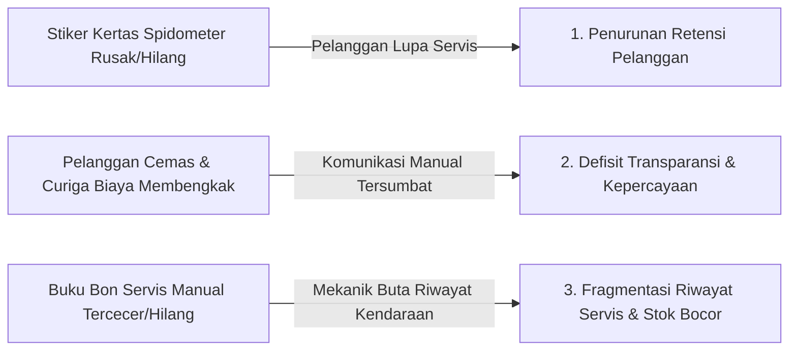
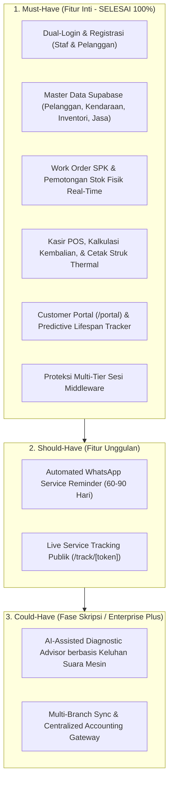
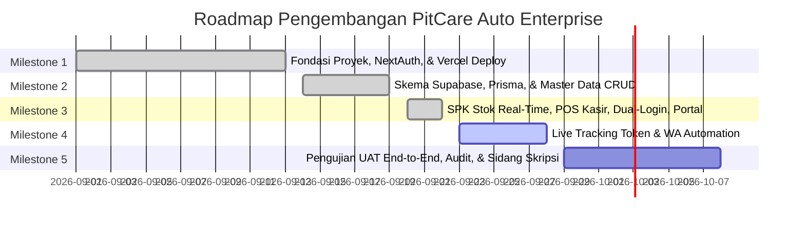

# PRODUCT REQUIREMENT DOCUMENT (PRD)
# PITCARE AUTO (`pitcare-auto`)
### *Enterprise Workshop Suite & Client Experience System*

> **Dokumen Spesifikasi Produk & Arsitektur Sistem**  
> **Versi:** 2.0.0 (Enterprise Production-Grade Release)  
> **Status:** Approved / Active Production Baseline  
> **Terakhir Diperbarui:** 22 September 2026  
> **Penulis:** Principal Software Architect & Lead Full-Stack Engineer  

---

## 1. Metadata Proyek

| Informasi | Keterangan |
| :--- | :--- |
| **Nama Aplikasi** | **PitCare Auto** (`pitcare-auto` / `bengkel-app`) |
| **Tagline** | *Enterprise Workshop Suite & Client Experience System* |
| **Deskripsi Singkat** | Sistem ekosistem manajemen operasional bengkel terintegrasi berskala enterprise. Mencakup digitalisasi penerimaan unit (SPK), alur mekanik dengan pemotongan stok suku cadang fisik otomatis di PostgreSQL Supabase, sistem kasir/billing POS dengan struk thermal siap cetak, sistem autentikasi ganda (*Dual-Portal: Internal Staff vs Customer Portal*), serta *Customer Portal* mandiri berfitur *Predictive Part Lifespan Tracker*. |
| **Tech Stack** | • **Framework:** Next.js 16.3.4 (App Router, Server Components & Server Actions)<br>• **UI & Styling:** React 19.2.8, Tailwind CSS v4 (`app/globals.css`), Pure Inline SVG Icons (Zero external UI/icon libraries)<br>• **Database & ORM:** PostgreSQL Supabase via Prisma ORM (Transaction-safe Real Database Connection Pooler)<br>• **Bahasa:** TypeScript 5 (Strict Mode, 0 type errors)<br>• **Autentikasi & Keamanan:** Dual-Login Architecture (NextAuth.js v4.24.15 untuk Staf Internal + Session Cookie terenkripsi untuk Pelanggan Portal)<br>• **Proteksi Akses:** Next.js `middleware.ts` berbasis token sesi |
| **Repository GitHub** | [https://github.com/PrabuPebe/bengkel-app.git](https://github.com/PrabuPebe/bengkel-app.git) |
| **Production URL** | [https://pitcareauto.vercel.app](https://pitcareauto.vercel.app) |
| **Akun Demo / Testing**| • **Staf Internal:** `admin22@gmail.com` / `mamang22` (atau registrasi akun staf baru di tab Staf)<br>• **Pelanggan Portal:** No. WhatsApp `081234567890` & No. Polisi `B 1234 XYZ` (atau registrasi pelanggan baru di tab Pelanggan) |
| **Status Saat Ini** | **Milestone 1, 2, & 3 Selesai (100%)**: Seluruh fondasi database PostgreSQL Supabase, CRUD master data, Work Order (SPK) dengan pemotongan stok otomatis real-time, Kasir POS dengan cetak struk thermal, Dual-Login, Customer Portal mandiri dengan pelacak usia suku cadang, dan proteksi middleware telah aktif dan teruji lolos kompilasi produksi. |

---

## 2. Problem Statement

Operasional bengkel kendaraan konvensional (khususnya skala UMKM dan menengah) masih menghadapi 3 masalah fundamental:



### 1. Masalah Retensi Pelanggan (*Customer Retention Gap*)
Sebagian besar bengkel hanya mengandalkan stiker kertas bertuliskan tangan yang ditempel di spidometer atau kaca depan untuk mencatat kilometer/tanggal servis berikutnya. Stiker ini sering terkelupas, pudar terkena cuaca/pencucian, atau diabaikan oleh pelanggan. Dampaknya:
- Pelanggan terlambat melakukan servis berkala atau bahkan berpindah ke bengkel kompetitor terdekat saat timbul kendala mendadak.
- Bengkel kehilangan potensi *recurring revenue* dari basis pelanggan yang sebenarnya sudah puas.

### 2. Masalah Transparansi & Kepercayaan (*Trust & Transparency Deficit*)
Saat pelanggan menitipkan kendaraannya di bengkel, timbul kecemasan emosional:
- Ketidakpastian apakah kendaraan sedang dikerjakan, sedang menunggu suku cadang, atau sudah selesai.
- Kekhawatiran penggantian suku cadang sepihak atau biaya perbaikan yang membengkak tanpa persetujuan awal (*hidden cost*).
- Pelanggan terpaksa bolak-balik menelepon atau mengirim chat manual yang mengganggu konsentrasi mekanik dan kasir.

### 3. Masalah Arsip, Riwayat Servis, & Kebocoran Stok (*Fragmented History & Stock Leakage*)
Pencatatan nota manual pada lembaran kertas nota atau buku besar menyebabkan riwayat kerusakan kendaraan sebelumnya mudah hilang dan stok gudang tidak akurat:
- Mekanik kesulitan mendiagnosis riwayat penggantian komponen terdahulu (misal: kapan terakhir ganti oli gardan, kampas rem, atau *timing belt*).
- Riwayat keluhan pelanggan yang berulang tidak terekam, sehingga solusi mekanik sering kali bersifat coba-coba (*trial & error*).
- Suku cadang keluar dari gudang tanpa pencatatan otomatis, menyebabkan selisih inventaris fisik dan pembukuan (*stock discrepancy*).

---

## 3. Value Proposition

> **"PitCare Auto mentransformasi bengkel konvensional menjadi ekosistem digital enterprise yang efisien, transparan, dan akuntabel. Kami menyatukan otomasi back-office (SPK, stok real-time, POS kasir) dengan Customer Portal mandiri yang menyajikan riwayat servis transparan dan pelacak prediktif penggantian suku cadang."**

Dengan memadukan fungsi internal bengkel (back-office) dan jembatan digital langsung ke pelanggan (customer portal tanpa perlu instalasi aplikasi native), PitCare Auto menghadirkan standar baru profesionalisme bengkel modern yang meningkatkan kepuasan pelanggan dan akurasi keuangan.

---

## 4. User Personas & Role-Based Access Control (RBAC)

Aplikasi melayani 5 profil pengguna dengan hierarki hak akses terisolasi:

### Persona Profil
1. **Owner / Workshop Administrator (Pak Joko):** Pemilik bengkel yang membutuhkan visibilitas menyeluruh terhadap omset harian, analitik performa bengkel, data pelanggan, kontrol inventaris suku cadang, dan audit transaksi.
2. **Kasir / Front Desk (Siti):** Petugas meja depan yang melayani pendaftaran masuk unit, memproses pembayaran kasir POS, menghitung diskon dan kembalian, serta mencetak struk faktur/thermal.
3. **Mekanik / Teknisi (Budi):** Teknisi pengerjaan fisik kendaraan yang menginspeksi keluhan, menambahkan suku cadang dan jasa riil ke SPK (yang otomatis memotong stok gudang secara fisik), dan memperbarui tahapan progres pengerjaan unit.
4. **Pelanggan Terdaftar Portal (Rian - Pelanggan Aktif):** Pemilik kendaraan yang masuk melalui tab Pelanggan di halaman login menggunakan No. WhatsApp dan No. Polisi. Memiliki akses ke *Customer Portal* pribadi (`/portal`) untuk melihat armada kendaraannya, status garansi, riwayat faktur transparan, indikator kesehatan suku cadang (*Predictive Lifespan Tracker*), dan pemesanan servis via WhatsApp.
5. **Pelanggan Tamu / Publik (Tamu - Tracking Cepat):** Pelanggan yang ingin memeriksa status pengerjaan spesifik unitnya secara instan via smartphone dengan memindai QR Code atau membuka tautan token acak (`/track/[token]`) tanpa perlu login.

### Matriks Hak Akses (RBAC Matrix)

| Fitur / Modul | Owner / Admin | Kasir | Mekanik | Pelanggan Portal (`/portal`) | Pelanggan Publik (`/track`) |
| :--- | :---: | :---: | :---: | :---: | :---: |
| **Login Dashboard Internal Staf** | Ya (Full) | Ya (Terbatas) | Ya (Terbatas) | Tidak | Tidak |
| **Login Customer Portal (`/portal`)** | Ya | Tidak | Tidak | **Ya (WA + Plat)** | Tidak |
| **Kelola Master Data (Suku Cadang/Jasa)** | Penuh (CRUD) | Baca Saja | Baca Saja | Tidak Ada Akses | Tidak Ada Akses |
| **Kelola Data Pelanggan & Kendaraan** | Penuh (CRUD) | Penuh (CRUD) | Baca Saja | Profil Sendiri | Tidak Ada Akses |
| **Buat & Edit Work Order (SPK)** | Penuh (CRUD) | Penuh (CRUD) | Update Pengerjaan | Tidak Ada Akses | Tidak Ada Akses |
| **Pemakaian Part (Potong Stok Supabase)** | Otomatis | Otomatis | **Otomatis Real-Time** | Tidak Ada Akses | Tidak Ada Akses |
| **Billing, Invoice, & Kasir POS** | Ya | **Ya (Penuh)** | Tidak | Akses Riwayat Faktur | Tidak Ada Akses |
| **Cetak Struk Kasir Thermal / A4** | Ya | **Ya** | Tidak | Cetak Faktur Digital | Tidak Ada Akses |
| **Predictive Part Lifespan Tracker** | Ya (Analitik) | Ya | Ya | **Ya (Interaktif)** | Tidak |
| **Akses Live Service Tracking via Token/QR** | Ya | Ya | Ya | Terintegrasi | **Ya (Tanpa Login)** |
| **Trigger Kirim Reminder WhatsApp** | Ya | Ya | Tidak | Tombol Booking WA | Tidak |
| **Registrasi Akun Baru (Staf & Pelanggan)**| Ya | Ya | Tidak | **Ya (Self-Service)** | Tidak |

---

## 5. Spesifikasi Fitur (MoSCoW Framework)



### 5.1. Fitur Inti (Must-Have) — *Status: Selesai (100%)*

1. **Dual-Login & Dual-Registration Portal (`app/login/page.tsx`)**
   - **Tab Staf Internal:** Autentikasi karyawan via NextAuth Credentials (Email/Password) dan Google OAuth. Tersedia modal formulir registrasi staf baru (`registerStaffAction`) langsung ke tabel `users` Supabase.
   - **Tab Pelanggan Bengkel:** Login cepat tanpa beban password dengan memasukkan No. WhatsApp dan Nomor Polisi kendaraan.
   - **Registrasi Pelanggan Mandiri:** Formulir self-service untuk mendaftarkan nama, nomor WhatsApp, nomor polisi, merk, dan tipe kendaraan langsung tersimpan fisik ke tabel `customers` dan `vehicles`.
   - **Proteksi Rute Multi-Tier (`middleware.ts`):** Mengamankan rute back-office (`/dashboard/*`, `/services/*`, `/cashier/*`, `/customers/*`, `/inventory/*`) hanya untuk staf terautentikasi, sementara `/login`, `/portal/*`, dan `/track/*` tetap dapat diakses sesuai izin sesi.

2. **Master Data PostgreSQL Supabase via Prisma ORM (`lib/db.ts`)**
   - Pelanggan & Kendaraan: Operasi CRUD langsung fisik ke database. Relasi 1 Pelanggan memiliki banyak kendaraan (*1-to-Many*).
   - Katalog Jasa Servis: Pengelolaan nama tindakan, estimasi durasi pengerjaan, dan tarif jasa.
   - Inventaris Suku Cadang: Pengelolaan SKU, nama part, stok fisik aktual, ambang batas peringatan stok menipis (*low stock threshold*), HPP, dan harga jual.

3. **Alur Pengerjaan Servis (Work Order / SPK) & Pemotongan Stok Real-Time**
   - Formulir pendaftaran unit baru: Input keluhan pelanggan, odometer masuk, pilihan mekanik, estimasi jasa & suku cadang.
   - Stepper status pengerjaan: `ANTRIAN` → `PENGERJAAN` → `MENUNGGU_PART` → `SELESAI_PENGERJAAN`.
   - **Atomic Stock Deduction:** Setiap penambahan suku cadang ke dalam SPK oleh teknisi langsung memotong jumlah stok fisik di tabel `parts_inventory` PostgreSQL Supabase secara atomik dalam transaksi Prisma. Pembatalan/penghapusan part otomatis mengembalikan stok (*refund stock*).

4. **Kasir POS & Billing Pembayaran (`app/(dashboard)/cashier/page.tsx`)**
   - Daftar antrian unit berstatus `SELESAI_PENGERJAAN`.
   - Kalkulasi otomatis: Total Jasa + Total Suku Cadang - Diskon = Total Tagihan Bersih.
   - Perhitungan nominal bayar dan kembalian secara presisi (mencegah input pembayaran kurang).
   - Update status transaksi menjadi `SELESAI_PEMBAYARAN` / `PAID`.
   - **Print-Ready Thermal Receipt Modal:** Dilengkapi tombol cetak struk nota kasir format thermal 58mm/80mm dan faktur A4 lengkap dengan rincian biaya, identitas kendaraan, dan ucapan terima kasih.

5. **Customer Portal Mandiri & Predictive Part Lifespan Tracker (`app/portal/page.tsx`)**
   - **Welcome Header & Vehicle Fleet Badges:** Menampilkan identitas pelanggan terverifikasi dan armada kendaraan yang dimiliki.
   - **Predictive Part Lifespan Tracker:** Algoritma pemantauan usia pakai suku cadang kritis berdasarkan odometer kendaraan:
     - Oli Mesin (*Engine Oil*): Siklus 3.000 KM (Indikator Hijau/Kuning/Merah jika butuh ganti segera).
     - Busi (*Spark Plug*): Siklus 8.000 KM.
     - V-Belt / Drive Belt: Siklus 24.000 KM.
   - **Riwayat Faktur Transparan:** Rekap seluruh invoice pengerjaan masa lampau lengkap dengan status lunas, rincian biaya jasa & part, dan nama mekanik.
   - **WhatsApp Booking Quick Trigger:** Tombol langsung terhubung ke nomor admin bengkel dengan format pesan reservasi otomatis.

---

### 5.2. Fitur Bernilai Tambah (Should-Have) — *Milestone 4*

1. **Automated WhatsApp Service Reminder**
   - Logika Interval Cerdas: Sistem menandai kendaraan yang telah melewati interval waktu **60 hingga 90 hari** sejak tanggal servis terakhir atau tanggal ganti oli.
   - Tombol Aksi Sekali Klik: Kasir/Admin dapat menekan tombol "Kirim Pengingat WA" dari daftar kendaraan jatuh tempo.
   - Template Pesan Otomatis (Deep Link `https://wa.me/{nomor}`):
     > *"Halo Bpk/Ibu [Nama Pelanggan], kami dari PitCare Auto menginformasikan bahwa kendaraan [Merk/Model] dengan plat nomor [Plat Nomor] sudah memasuki waktu servis berkala/ganti oli (terakhir servis tanggal [Tanggal Servis]). Yuk rawat performa kendaraan Anda kembali di bengkel kami. Balas pesan ini untuk reservasi waktu. Terima kasih!"*

2. **Live Service Tracking (Pelacakan Transparan Publik via Token / QR Code)**
   - Halaman publik ringan (`/track/[token]`) yang aman dengan token URL acak (UUID/NanoID).
   - Akses Tanpa Beban Login: Dicantumkan berupa link pendek atau QR Code pada lembar tanda terima/struk masuk.
   - Pelanggan dapat memantau status kendaraan secara *real-time* (Antrian → Dikerjakan → Selesai), rincian suku cadang & jasa yang dikerjakan beserta nominal biaya transparan, serta estimasi waktu selesai.

---

### 5.3. Fitur Masa Depan (Could-Have) — *Fase Skripsi Lanjutan*

1. **AI Diagnostic Engine**: Rekomendasi otomatis komponen yang wajib diperiksa berdasarkan analisis keluhan teks pelanggan dan rekam jejak odometer.
2. **Multi-Cabang & Sinkronisasi Gudang**: Integrasi transfer stok antar-cabang bengkel dan konsolidasi laporan laba-rugi multi-outlet.

---

## 6. Batasan Ruang Lingkup (Scope Boundaries)

```
┌───────────────────────────────────────────────┬───────────────────────────────────────────────┐
│                   IN-SCOPE                    │                 OUT-OF-SCOPE                  │
├───────────────────────────────────────────────┼───────────────────────────────────────────────┤
│ • Arsitektur Monolitik Next.js 16 App Router  │ • Integrasi Hardware Scanner Fisik OBD-II     │
│ • Database Relasional PostgreSQL Supabase     │ • Modul Pajak Korporat Kompleks (e-Faktur DJP)│
│ • Pemotongan Stok Atomik via Prisma TX        │ • Integrasi Payment Gateway Otomatis          │
│ • Dual-Login: Staf Internal & Customer Portal │ • Aplikasi Mobile Native (iOS / Android APK)  │
│ • Customer Portal (/portal) & Lifespan Tracker│ • Integrasi GPS Tracking Posisi Real-time     │
│ • Cetak Struk Kasir Thermal (58/80mm) & A4    │ • Multi-Gudang Kompleks Antar-Pulau           │
│ • Live Service Tracking Publik (/track/[token])│                                              │
│ • Pengingat Servis Otomatis WhatsApp Deep Link│                                              │
└───────────────────────────────────────────────┴───────────────────────────────────────────────┘
```

---

## 7. Arsitektur Folder Aktual (Production-Grade)

Struktur folder aktual yang telah teruji lolos kompilasi produksi Next.js 16:

```text
bengkel-app/
├── app/
│   ├── (dashboard)/
│   │   ├── layout.tsx                # Layout shell dashboard staf (Header, Navigasi, User Profile)
│   │   ├── dashboard/
│   │   │   └── page.tsx              # Overview metrik operasional, antrian aktif, pendapatan, quick stats
│   │   ├── services/
│   │   │   ├── page.tsx              # Daftar SPK (Antrian, Pengerjaan, Menunggu Part, Selesai)
│   │   │   ├── new/page.tsx          # Formulir penerimaan servis unit baru (Input SPK)
│   │   │   └── [id]/page.tsx         # Stepper mekanik, tambah part (potong stok real), update status
│   │   ├── customers/
│   │   │   ├── page.tsx              # Manajemen master data pelanggan & kendaraan
│   │   │   └── [id]/page.tsx         # Riwayat servis per pelanggan & nomor polisi
│   │   ├── inventory/
│   │   │   ├── parts/page.tsx        # Katalog suku cadang, update stok, peringatan stok menipis
│   │   │   └── services/page.tsx     # Master katalog tindakan jasa servis & tarif
│   │   ├── cashier/
│   │   │   └── page.tsx              # Antrian kasir, kalkulasi POS, bayar, & cetak struk thermal
│   │   └── reminders/
│   │       └── page.tsx              # Daftar kendaraan jatuh tempo servis & trigger pengingat WhatsApp
│   ├── login/
│   │   └── page.tsx                  # Dual-Portal Login (Tab Staf + Registrasi & Tab Pelanggan + Registrasi)
│   ├── portal/
│   │   └── page.tsx                  # Customer Portal mandiri (Fleet badges, Part Lifespan Tracker, Faktur)
│   ├── track/
│   │   └── [token]/
│   │       └── page.tsx              # Live Service Tracking publik tanpa login
│   ├── api/
│   │   └── auth/
│   │       └── [...nextauth]/
│   │           └── route.ts          # API Handler autentikasi NextAuth
│   ├── favicon.ico
│   ├── globals.css                   # Tema warna PitCare Auto & integrasi Tailwind CSS v4
│   ├── layout.tsx                    # Root Layout aplikasi
│   └── page.tsx                      # Landing page redirector (otomatis ke dashboard atau login)
├── components/
│   ├── dashboard/                    # Komponen modular shell staf (Sidebar, Topbar, StatusBadge)
│   ├── ui/                           # Komponen UI atomik
│   └── providers.tsx                 # Client SessionProvider NextAuth
├── lib/
│   ├── actions/
│   │   ├── auth.ts                   # Server Action registrasi staf baru
│   │   └── customer-portal.ts        # Server Action login & registrasi pelanggan portal
│   ├── auth.ts                       # Konfigurasi NextAuth terpusat (Credentials & Google Provider)
│   ├── db.ts                         # Prisma ORM client & transaksi PostgreSQL Supabase real-time
│   ├── utils.ts                      # Formatter mata uang Rupiah & format tanggal Indonesia
│   └── whatsapp.ts                   # Builder link WhatsApp Deep Link & template pesan
├── prisma/
│   └── schema.prisma                 # Skema data relasional PostgreSQL Supabase
├── docs/
│   ├── PRD.md                        # [DOKUMEN INI] Single Source of Truth Spesifikasi Produk PitCare Auto
│   └── logbook/
│       ├── 01-log-milestone-1-auth.md
│       ├── 02-log-milestone-2-database.md
│       └── 03-log-milestone-3-enterprise-flow.md
├── middleware.ts                     # Proteksi rute internal berbasis sesi NextAuth & Portal cookie
├── next.config.ts                    # Konfigurasi Next.js 16
├── package.json                      # Dependensi proyek (Zero external icon/UI library)
└── tsconfig.json                     # Konfigurasi TypeScript 5 (Strict Mode)
```

---

## 8. Roadmap & Milestone Pengembangan



### Milestone 1: Fondasi Proyek, Autentikasi Staf, & Deployment Baseline (*STATUS: SELESAI - 100%*)
- Setup Next.js 16 App Router dengan TypeScript 5 dan Tailwind CSS v4.
- Implementasi halaman kustom login dengan desain premium PitCare Auto.
- Integrasi NextAuth.js (Credentials & Google OAuth Provider).
- Setup CI/CD dan deployment otomatis stabil di Vercel (`https://pitcareauto.vercel.app`).

### Milestone 2: Skema PostgreSQL Supabase & Master Data CRUD (*STATUS: SELESAI - 100%*)
- Pembuatan skema data relasional di Prisma ORM (`users`, `customers`, `vehicles`, `parts_inventory`, `services_catalog`, `service_orders`, `order_items`).
- Koneksi ke PostgreSQL Supabase Connection Pooler (`DIRECT_URL` & `DATABASE_URL`).
- Implementasi CRUD Master Pelanggan & Multi-Kendaraan.
- Implementasi CRUD Katalog Jasa Servis & Inventaris Suku Cadang (dengan indikator stok minimum).

### Milestone 3: Enterprise Flow — SPK Real-Time, POS Kasir, Dual-Login, & Customer Portal (*STATUS: SELESAI - 100%*)
- **Dual-Login & Registrasi:**
  - Tab login Staf Internal + formulir registrasi karyawan baru.
  - Tab login Pelanggan Mandiri (No. WhatsApp & No. Polisi) + formulir registrasi pelanggan baru.
- **Work Order (SPK) & Pemotongan Stok Fisik:**
  - Form pendaftaran unit masuk (keluhan, odometer, mekanik).
  - Penambahan sparepart oleh mekanik secara otomatis memotong stok fisik di tabel `parts_inventory` PostgreSQL Supabase secara atomik via Prisma Transactions.
- **Kasir POS & Billing Pembayaran:**
  - Penghitungan tagihan jasa + sparepart, diskon, dan kembalian tunai/transfer.
  - Modal cetak nota struk kasir thermal (58mm/80mm) dan faktur A4.
- **Customer Portal Mandiri (`/portal`):**
  - Dashboard khusus pelanggan dengan welcome badge armada kendaraan.
  - *Predictive Part Lifespan Tracker* (Oli Mesin 3.000 KM, Busi 8.000 KM, V-Belt 24.000 KM).
  - Rekap riwayat faktur transparan & tombol booking via WhatsApp.
- **Proteksi Rute Multi-Tier:**
  - Pemasangan `middleware.ts` untuk mengamankan modul back-office staf tanpa menghalangi `/portal`, `/login`, dan `/track/*`.

### Milestone 4: Fitur Unggulan — Live Service Tracking & WA Automation (*STATUS: AKTIF / TAHAP BERIKUTNYA*)
- **Live Service Tracking**:
  - Generator token acak unik (NanoID/UUID) pada setiap Work Order.
  - Halaman publik `/track/[token]` yang responsif untuk smartphone pelanggan tanpa perlu login.
  - Visual timeline progres pengerjaan & rincian biaya aktual.
- **Automated WhatsApp Service Reminder**:
  - Filter analitik kendaraan yang telah melewati masa servis 60–90 hari.
  - Tombol aksi trigger link `wa.me` dengan format pesan personal otomatis untuk reservasi kembali.

### Milestone 5: Pengujian (UAT), Hardening Keamanan, & Sidang Tugas Akhir (*STATUS: AKAN DATANG*)
- User Acceptance Testing (UAT) simulasi alur end-to-end (Pendaftaran → Pengerjaan → Live Tracking → Kasir → Reminder).
- Optimasi performa LCP/INP & audit aksesibilitas (WCAG 2.2).
- Penyusunan dokumentasi teknis & lampiran hasil pengujian untuk skripsi/sidang tugas akhir.

---

> **Persetujuan & Kebijakan Perubahan:**  
> Segala perubahan pada dokumen PRD ini telah diselaraskan secara resmi dengan kode sumber aktif (*Single Source of Truth*) pada repositori [https://github.com/PrabuPebe/bengkel-app.git](https://github.com/PrabuPebe/bengkel-app.git).
